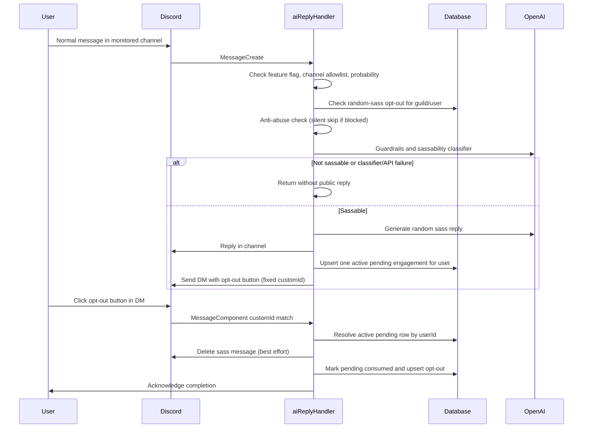

### Summary

Add a rare (~0.1%, configurable) **unsolicited “random sass”** path for normal chat messages in configured monitor channels: after guardrails and a dedicated **sassability** classifier (to avoid relationship advice, crisis, and other heavy topics), BrattyBot replies in-channel in the same voice as existing on-topic replies, then contacts the author privately with an opt-out control. **Opt-out** is stored per `(guild, user)` and removes that user from future random sass; activating it also **deletes the sass message** when the API allows. **Success** means the feature is gated, safe-by-default on failures, compatible with `InteractionsRegistry` (fixed `customId`), and does not send anti-abuse warning embeds for users who never @’d the bot.

### Flow (Sequence Diagram)

### Files to Create

- [`src/features/ai-reply/data/aiReplyRandomEngagementSchema.ts`](src/features/ai-reply/data/aiReplyRandomEngagementSchema.ts) — Kysely types for two tables (or one table with nullable fields): **`ai_reply_random_opt_out`** (`guildId`, `userId`, `createdAt`) and **`ai_reply_random_pending_engagement`** (`guildId`, `userId`, `channelId`, `sassMessageId`, `expiresAt`, `createdAt`, `consumed` boolean). Purpose: opt-out persistence + **at most one active pending engagement per `(guildId, userId)`** so every DM button can use the **same** `customId` (see Implementation Steps).
- [`src/features/ai-reply/data/aiReplyRandomEngagementRepo.ts`](src/features/ai-reply/data/aiReplyRandomEngagementRepo.ts) — `isOptedOut`, `upsertOptOut`, `insertPendingEngagement` (replace/upsert for user+guild), `getActivePendingForUser`, `markPendingConsumed`.
- [`src/features/ai-reply/agents/agentSassabilityClassifier.ts`](src/features/ai-reply/agents/agentSassabilityClassifier.ts) — Zod schema (e.g. `sassable: z.enum(['yes', 'no'])`) + `Agent` on a small model (align with [`agentOffTopicDetector.ts`](src/features/ai-reply/agents/agentOffTopicDetector.ts): `gpt-5-nano`, low reasoning, `store: false`). Instructions: reject relationship/therapy/crisis/legal/medical, harassment targets, minors, hate, self-harm, explicit heavy trauma, etc.; allow casual chat suitable for playful bratty banter.
- [`src/features/ai-reply/agents/agentRandomSassReply.ts`](src/features/ai-reply/agents/agentRandomSassReply.ts) — Reply agent using [`buildAgentPromptInstructions`](src/features/ai-reply/agents/agentBase.ts): same Bratty voice as [`agentReplyOnTopic.ts`](src/features/ai-reply/agents/agentReplyOnTopic.ts) but prompt emphasizes **unsolicited** playful sass (short, not asking them to @ you).
- [`src/features/ai-reply/randomSassWorkflow.ts`](src/features/ai-reply/randomSassWorkflow.ts) — `runRandomSassWorkflow(...)` entrypoint: reuse [`runAndApplyGuardrails`](src/features/ai-reply/lib/oaiAgentGuardrails.ts); on tripwire **fail closed** (no sass); run sassability classifier; if not sassable, return empty; else run `Runner` with recent channel context (reuse `generateOnTopicResponse`-style history shaping from [`newAiReplyStuff.ts`](src/features/ai-reply/newAiReplyStuff.ts) or import shared helper) + **new** sass agent. **Do not** call `checkIsOnTopic` / off-topic agents (avoids wrong branch and extra cost).
- [`src/features/ai-reply/components/dontEngageRandomSassButton.ts`](src/features/ai-reply/components/dontEngageRandomSassButton.ts) — `ButtonBuilder` with **fixed** `customId` (e.g. `ai_reply_dont_engage_random` — must be unique vs ticket/birthday ids). Export builder for DM attach + `handler` for `ButtonInteraction`: load pending row for `interaction.user.id` (and validate row’s `guildId`/`userId`); if missing/expired, return friendly error; verify `interaction.user.id === row.userId`; delete `sassMessageId` in `channelId` (try/catch); mark consumed; `upsertOptOut`; return `InteractionHandlerResult` (DM: ephemeral reply still works for acknowledge per registry `finally` behavior).

- [`src/features-system/data-persistence/migrations/YYYY-MM-DD-Create_Ai_Reply_Random_Tables.ts`](src/features-system/data-persistence/migrations/YYYY-MM-DD-Create_Ai_Reply_Random_Tables.ts) — Parallel **sqlite** and **postgres** sections mirroring [`2026-01-06-Create_Birthday_Table.ts`](src/features-system/data-persistence/migrations/2026-01-06-Create_Birthday_Table.ts): indexes on `(guild_id, user_id)` for opt-out and pending.

### Files to Modify

- [`src/features/ai-reply/aiReplyHandler.ts`](src/features/ai-reply/aiReplyHandler.ts) — Refactor `handleAIReply` into clear branches: (1) existing **mention/reply** path unchanged after `shouldRespondToMessage` is true; (2) new **random sass** path when false: gates for `AI_RANDOM_SASS_ENABLED`, `BOT_CONFIG.channelsToMonitor.includes(channel.id)`, `Math.random() < AI_RANDOM_SASS_PROBABILITY`, minimum content length (ignore empty/sticker-only), optional skip for obvious bot/command prefixes; `repo.isOptedOut` early exit; **anti-abuse**: if `!allowed`, **return without** `message.reply` embeds (silent skip); then `aiPendingReplyTracker` + `runRandomSassWorkflow`; on success `message.reply` + insert pending row + `message.author.send({ components })`; on DM failure log and leave public sass (or product choice: delete sass if DM required — **defer** unless stakeholders want strict coupling). Outer **`try/finally`** ensures `aiPendingReplyTracker.removePendingReply` on all exits including classifier/API failures (**fail closed**: no public sass on thrown errors after roll).
- [`src/features/ai-reply/aiReplyHandler.ts`](src/features/ai-reply/aiReplyHandler.ts) — Extend **`initAIReply()`** to `interactionsRegistry.register(dontEngageButtonBuilder, handler)` (same file exports `initAIReply` today — there is **no** [`initAIReply.ts`](src/features/ai-reply/initAIReply.ts); do not invent that path).
- [`src/features/ai-reply/index.ts`](src/features/ai-reply/index.ts) — Re-export any new public symbols only if other features need them (optional).
- [`src/features-system/data-persistence/database.ts`](src/features-system/data-persistence/database.ts) — Add both tables to `Database`; extend **`SqlDatePlugin`** with camel columns for each table’s `createdAt` / `expiresAt` as needed (match [`birthdays`](src/features-system/data-persistence/database.ts) pattern — **do not** leave as “if used”).
- [`src/environment.ts`](src/environment.ts) — Add `AI_RANDOM_SASS_ENABLED` via `getBoolOptional` (default `false` for safe rollout). Add `AI_RANDOM_SASS_PROBABILITY` using `env-var` **float in [0, 1]** (e.g. `env.get('AI_RANDOM_SASS_PROBABILITY').default('0.001').asFloatPositive()` with an explicit clamp ≤ 1 or use a supported restricted-range API if available in this project’s `env-var` version — document the exact call in implementation).
- [`src/botConfig.ts`](src/botConfig.ts) — **Rollout**: either default `channelsToMonitor` to `[]` until operators opt in, or document that wiring this feature will use the existing non-empty default channel id (reviewer note: today one id is present but unused — turning the feature on + `enabled` true affects that channel first).

### Implementation Steps

1. **DB layer** — Add schema interfaces, migration (sqlite + postgres), register in [`database.ts`](src/features-system/data-persistence/database.ts) + `SqlDatePlugin` for all date columns. Implement repo with idempotent opt-out upsert and pending row semantics (enforce single active pending per guild+user in repo or with partial unique index where supported; for sqlite, use transaction + delete previous pending for that pair before insert).

2. **Env** — Add `AI_RANDOM_SASS_ENABLED` and `AI_RANDOM_SASS_PROBABILITY` in [`environment.ts`](src/environment.ts) per repo conventions (`repository-spine.mdc`).

3. **Agents + workflow** — Add sassability classifier and `agentRandomSassReply`. Implement `runRandomSassWorkflow` in **`randomSassWorkflow.ts`** to avoid bloating [`newAiReplyStuff.ts`](src/features/ai-reply/newAiReplyStuff.ts); share only small helpers if needed (extract history builder to a shared module **only if** duplication exceeds ~10–15 lines — otherwise keep one import from `newAiReplyStuff` private helpers or duplicate minimally per `implementation-philosophy.mdc`).

4. **Handler branch** — In [`aiReplyHandler.ts`](src/features/ai-reply/aiReplyHandler.ts), implement fast filters before `sendTyping` where possible; for unsolicited path, **only** call `sendTyping` after passing random gate + opt-out + “will attempt” to limit noise. Reuse `userInteractionTracker` only if appropriate; **do not** surface anti-abuse embeds when the user did not invoke the bot — silent skip.

5. **Fixed `customId` + pending row** — When sending the DM, **persist** `guildId`, `userId`, `channelId`, `sassMessageId`, `expiresAt` (e.g. 24–72h TTL). Button uses **one** `customId` registered in [`interactionsRegistry.ts`](src/features-system/commands/interactionsRegistry.ts) routing (full string match in [`handleMessageComponentInteraction`](src/features-system/commands/interactionsRegistry.ts)). Handler resolves context from DB by `interaction.user.id` + non-consumed + non-expired pending row (and validate guild/user match). **Do not** encode four snowflakes in `customId` unless registry gains prefix routing (out of scope — prefer fixed id + DB).

6. **Registration** — In `initAIReply()`, register the button builder + handler. No `bot.ts` change required unless you split init into a second exported function for clarity (optional).

7. **Observability** — Log at info/debug when random path triggers, when classifier blocks, when DM fails; never log message body content at info in production if policy discourages PII (follow existing `console.log` patterns in ai-reply).

### Testing Strategy

- **Unit (Vitest)** — Repo: opt-out idempotency; pending insert replaces prior; consumed flag; expired pending ignored. Classifier: Zod parse of mocked agent output. Button handler: wrong user (no row / mismatch) returns error result; happy path calls delete + DB updates (mock Discord API).
- **Integration / manual** — Set `AI_RANDOM_SASS_ENABLED=true` and temporarily `AI_RANDOM_SASS_PROBABILITY=1` in dev `.env.local` only; verify classifier blocks a crafted sensitive line; verify no reply on OpenAI throw; verify opt-out prevents second attempt; verify button deletes sass message.
- **Edge cases** — Missing permissions to delete sass message; DM closed; concurrent messages (pending row overwrite); guild-less edge cases (random sass should already require `message.guildId`).

### Risks & Considerations

| Area | Risk | Mitigation |
|------|------|------------|
| **Discord API** | True in-channel **ephemeral** without interaction is impossible | DM for opt-out UI (private); document product acceptance. |
| **Registry** | Unique per-message `customId` breaks routing | Fixed `customId` + DB-backed pending engagement (addresses Critical review finding). |
| **Anti-abuse** | Current embed replies assume user contacted bot | Silent skip unsolicited path when blocked (addresses High review finding). |
| **Safety** | Classifier or API failure | Fail closed: no public sass; `finally` clears pending tracker (addresses High review finding). |
| **Workflow** | Off-topic agent wrong for drive-by sass | Dedicated `runRandomSassWorkflow` without `checkIsOnTopic` (addresses Medium review finding). |
| **Rollout** | Default channel id in `botConfig` | Prefer `AI_RANDOM_SASS_ENABLED` default false + explicit ops checklist; consider empty `channelsToMonitor` until configured. |
| **Product** | Opt-out scope | Plan assumes opt-out affects **random sass only**; @mention / reply behavior unchanged — confirm with stakeholders. |
| **Audit** | Button clicks are not slash commands | `logCommand` may not run; acceptable unless audit must capture component events (defer). |

### Deferred / Open (explicit)

- **Prefix-based `InteractionsRegistry`** — Not required if fixed `customId` + pending table is used.
- **Strict “delete sass if DM fails”** — Deferred unless required; otherwise public sass may remain without opt-out affordance.
