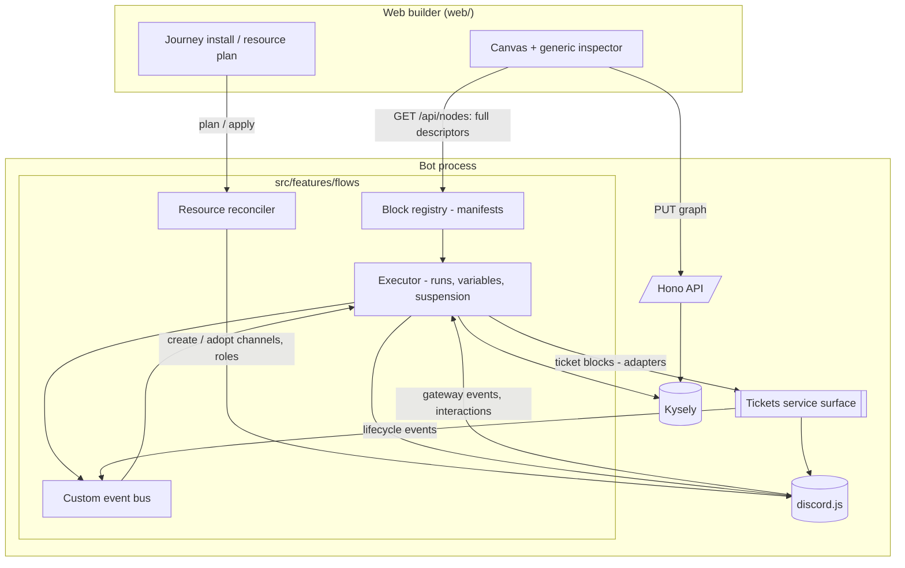
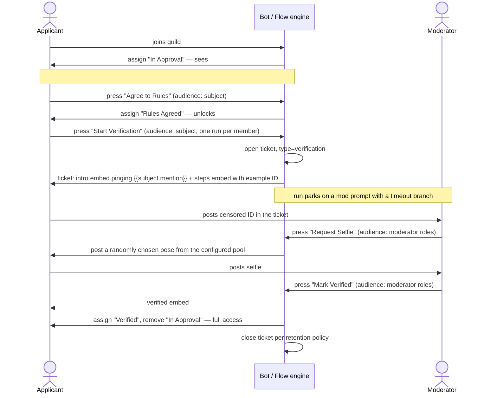

# PRD — Flow Engine v2: Composable Blocks, Member Journeys, and Server Provisioning

> **Status**: Approved
> **Owner**: Douglas
> **Last updated**: 2026-09-12
> **Scope**: Turn the shipped flow engine into a composable block platform that can express a complete, multi-day, multi-actor member journey — onboarding → rules → verification ticket → verified — including the tickets it opens and the Discord channels, categories, and roles it needs, all authored in the flow builder without hand-editing the Discord server.
> **Does not cover**: Multi-tenant/billing, a public template marketplace, arbitrary code/script nodes, migrating existing features (leveling, warnings, birthdays, ai-reply) onto flows, and the age-verification *policy* itself (this PRD covers the mechanics of the existing process, not whether that process is sufficient).

## 1) Summary

The flow engine shipped in `nimbalyst-local/plans/web-ui-and-flow-engine.md` proved the model: a `flows` table holding a node graph, a self-describing node registry, a durable executor with suspend/resume, and a React Flow canvas. Twelve node types cover `button click → assign role → send DM`.

That is not enough to express the thing we actually run our server on. Our real onboarding journey spans **days**, **two different actors** (the applicant and a moderator), **a ticket**, **five channels**, **four roles**, and **two steps that today only happen because a human remembers to type `/selfie` and `/verified`**. Encoding it needs three capabilities the engine does not have — mid-run interactive prompts that only moderators may press, a ticket system flows can drive and query, and the ability to create the channels/roles/permissions a journey depends on — and it needs them without the node catalogue tripling the cost of every change.

So this PRD has two halves, and the first one is load-bearing:

**Half one — make the surface a real contract.** Adding a node type today touches 9 sites across 5 files, 5–6 of them hand-maintained frontend catalogues (`web/src/flows/nodeMeta.ts`, `web/src/flows/NodeInspector.tsx`) with no compile-time link to the backend registry; every omission fails silently and late. The executor special-cases two node types by string literal (`executor.ts:158`, `:180`). Node kind is re-derived client-side by string prefix (`nodeMeta.ts:88`) rather than trusted from the server. Going from 12 blocks to ~35 on that foundation guarantees drift. We widen the node definition into a **block manifest** that is the single source of truth for runtime *and* builder, and the builder becomes generic. The v1 design doc pre-authorised exactly this: *"if the catalogue grows large, revisit a schema-driven renderer with per-field UI hints"* (§5.5). We are past that threshold.

**Half two — build the blocks the journey needs.** Run variables and a subject/actor split so a moderator can act *on* an applicant's run. Interactive prompt blocks with audience gating, so `/selfie` and `/verified` become buttons a mod presses inside the ticket. A named custom-event bus so flows and features signal each other without knowing about each other. Tickets promoted from an embed-encoded blob into typed, queryable records that flow blocks drive through a service boundary. And declarative resource provisioning — a flow states the channels, categories, and roles it needs, previews a plan, and applies it, so setting up a journey never means clicking through Discord's permission matrix.

The product test is single and concrete: **rebuild our live onboarding and verification journey entirely in the builder, on a fresh guild, with no hand-created channels or roles and no bespoke code.**

Design constraints inherited from the repo, not restated here: `AGENTS.md` (feature-folder shape, persistence, interaction routing), `.claude/rules/implementation-philosophy.md` (no goldplating, no framework-for-one-call-site), `.claude/rules/elegance.md` (wiring vs behavior vs domain vs persistence), `.claude/rules/root-cause-over-workarounds.md` (no silent alternates), `.claude/rules/product-persona-and-audience.md` (adults-only voice is intentional), `.claude/rules/discord-interactions.md`, `.claude/rules/data-persistence.md`.

### 1.1 Vocabulary

Introduced here so the rest of the document and the code can agree.

| Term | Meaning |
| --- | --- |
| **Block** | A node *type* — the Lego piece. Declared once in `src/features/flows/blocks/<name>/`, self-describing via a manifest. |
| **Node** | An *instance* of a block placed on a canvas, with config. (Unchanged: `FlowNode` in the persisted graph.) |
| **Flow** | One canvas. **May contain many triggers, each rooting an independent path** — a flow is not one-trigger-one-ending. A whole journey can live on a single canvas if the author prefers it that way. |
| **Journey** | A named bundle: one or more flows + the resources they declare + default copy. **The journey owns the resources.** The installable unit. A journey may be a single flow. |
| **Run** | One execution of a flow for one subject. Durable when it suspends. |
| **Subject** | The member the run is *about* (the applicant). |
| **Actor** | Whoever caused the current step (the applicant, a moderator, or nobody on a timer resume). |
| **Resource** | A Discord channel, category, or role a flow declares it needs, referenced by a stable key rather than a snowflake. |

### 1.2 Milestones

> **Superseded as a plan, retained as intent (2026-09-13).** These six milestones describe *what the engine should eventually do* and remain useful for that. They are no longer the unit of work — planning a milestone at a time produced scope that outran the product bar it was meant to clear. The build order is **§1.3's six steps**, planned one at a time: see [flow-engine-v2-build-order.md](flow-engine-v2-build-order.md).

**M1 — Block contract v2** — the Lego standard. No new user-visible capability; the enabling refactor.

- One block lives in one directory and needs no edits anywhere else to appear correctly in the palette, on the canvas, and in the inspector.
- The builder renders every block's config form from the manifest; the hand-maintained frontend catalogues are deleted.
- The executor no longer knows any block type by string literal — because "what a block did" becomes an explicit outcome the block returns, rather than something the executor infers.
- A conformance test suite fails CI when a block's manifest is incomplete or disagrees with its runtime behavior.

- **Both interpreter enums reach their final shape here** — the run lifecycle *and* the step outcome. They are frozen from the end of M1, so they must be right before the freeze, not after (§5.13).

*Other state machines land later*: ticket lifecycle in M4, resource binding and journey install in M5. §5.13 states the guarantees they all owe.

**M2 — Run data flow** — blocks can pass things to each other.

- Runs carry named variables; blocks declare their outputs; downstream config binds to them by picker, not by typing IDs.
- Subject and actor are separate; a moderator can advance someone else's run.
- User-facing copy supports a small, declared token vocabulary (`{{subject.mention}}`, …) rendered by one shared renderer.
- Full embed authoring (image, thumbnail, author, footer, fields) — enough to reproduce our verification embeds.
- A *trigger* can be configured to allow at most one live run per subject.

**M3 — Interaction & events** — the journey stops depending on human memory.

- **Shared guild settings first** (§5.12): moderator roles promoted out of tickets, so the audience vocabulary has one definition to read. Everything else in M3 depends on it.
- A block can post a message with choice buttons, park the run, and resume on the choice pressed — with an audience gate (`subject` / `roles` / `Discord permission` / member reference / `anyone`).
- Operators can cancel a run. (Retry and force-advance stay in M6; cancel does not, because §5.13's terminal-state guarantee is otherwise unsatisfiable from M3 to M6 — including during M4's cutover.)
- Named custom events: blocks emit them, triggers fire on them, waits park on them; features outside flows can emit too.
- (The four Discord gateway triggers — message posted, role gained/lost, member left — are deferred out of this wave; see M4.)
- Minimal operations view: for a flow, who is parked where, for how long, and what failed.

**M4 — Tickets as a flow capability** — a *full refactor* of the tickets feature: typed, durable, and drivable.

- Ticket *types* (support / verification / admin …) with their own category, naming, permissions, opening content, and button set.
- A durable ticket record is the source of truth; the pinned embed becomes a rendering of it. Existing button handlers move onto the same service — one mechanism, no permanent legacy path.
- Blocks to open, post into, claim, close, and delete tickets; triggers for ticket lifecycle events.
- The four Discord gateway triggers, deferred out of M3 so the hardest wave stays narrow.
- Moderator-only flow buttons render inside a ticket alongside the standard controls.
- Live tickets open at cutover are migrated. A short, announced disruption window is acceptable (single guild, operator is its admin); a permanently broken or silently degraded ticket path is not.

**M5 — Provisioning** ⚠️ **highest-risk milestone** — the journey builds the basics, not the admin. **Forward-only and adopt-first.**

*Why it is the risk: M5 is simultaneously a new backend subsystem (reconciler, binding table, permission-intent compiler), a fiddly new frontend surface (ranked autocomplete with duplicate-name disambiguation), and **the only irreversible mutation of a live Discord guild** in the programme. It also has the lowest parallelisable ratio of any milestone — almost all of it is serial design work. Treat a slip here as expected rather than exceptional, and see the execution strategy for the containment plan.*

- A *journey* declares the channels, categories, roles, and subsystem configuration (e.g. a ticket type) it needs, with *permission intent* (e.g. "visible only to holders of role X") rather than raw overwrites.
- Existing channels and roles are **reused, not duplicated**; the engine verifies they are configured the way the journey requires and reports what is off.
- Plan → preview → apply, with an explicit teardown policy. Provisioning is opt-in per resource: an operator can always do it by hand instead.
- Bot-capability preflight, including role hierarchy, before anything is created.

**M6 — The onboarding journey** — the proof.

- The journey bundle and install wizard (§5.8) — M5 delivers the resource engine, M6 delivers the thing operators install.
- The refactored journey (welcome → rules → verify → ticket → selfie → verified) ships as an installable journey template — a **starting point the operator edits**, not a specification of anyone's approval process. What the outcomes are, which buttons exist, and what each one does are authored at runtime.
- Operator retry and force-advance controls, deferred here from M3 (§8 Q11).
- It is installed on a fresh test guild from zero, then stood up on the live server. Members who already hold today's roles are **not** migrated by the engine — that remains a manual administrator task (§8 Q9).

**Later** (not this slice):

- Journey/template gallery beyond the shipped onboarding template.
- Sub-flows / reusable graph fragments called from a parent flow.
- Parallel branches with join semantics.
- Analytics beyond the M3 operations view (funnel conversion, time-to-verify).
- Migrating leveling / warnings / birthdays onto blocks.

**Back pocket** (not scheduled):

- Versioned flows with draft/publish and rollback.
- Per-block retry/compensation policy.
- A/B testing journey variants.
- Cross-guild journey export/import.
- **Armed triggers**: an edge from a block in one path to a trigger in another, arming that trigger only once a subject has reached that point. Declined for now (§8 Q14) — it needs new per-subject-per-node durable state and gives graph edges a second meaning, while role conditions, audience gates, and custom events already express the same intent. Revisit if authoring real journeys shows those three are genuinely insufficient.

### 1.3 Sequencing

Product order — what must be true before the next outcome is possible. **Strictly bottom-up** (resolved, §8): M1 lands before any new block is authored, so no block is written twice and the duplicated frontend catalogues never grow further. This deliberately inverts the v1 design doc's bet (Phase 3 shipped a working flow before the canvas) — the cost of that bet is the drift M1 now has to unwind.

| Step | Outcome | Done when |
| --- | --- | --- |
| **1** | Adding a block is cheap and safe | A new block ships by adding one directory; conformance tests catch an incomplete manifest; the builder needs no edit |
| **2** | Blocks compose | A block can consume a value another block produced, and copy can address the subject |
| **3** | A run can ask a human a question | A moderator presses a button in a channel and *that* parked run advances; non-moderators are refused |
| **4** | A flow can open and drive a ticket | A verification ticket is opened by a flow, is distinguishable from a support ticket, and its channel is addressable by later blocks |
| **5** | A journey can build its own home | Installing a journey on an empty guild creates its categories, channels, and roles with correct visibility |
| **6** | The real journey runs on it | Our onboarding and verification runs end-to-end on the engine with no bespoke code |

## 2) Goals

- **G1 — Uniform extension.** A new capability is added by writing one self-contained block, not by threading a change through the engine, the API, and five frontend catalogues. Target: adding a block touches **exactly one new directory** — no registry edit, no barrel edit, and zero files under `web/src/flows/`. (Shared-file registration is not merely inconvenient; it is what makes parallel block authoring impossible.)
- **G2 — Express the real journey.** Our live onboarding + verification process is representable end-to-end as flows, with no step depending on a human remembering a slash command.
- **G3 — No server fiddling.** A journey installs onto a guild that has none of its channels, categories, or roles, and produces a correct, previewed result.
- **G4 — Nothing hardcoded to one server.** Every channel, role, category, message, pose list, and permission rule in the onboarding journey is configuration, not code. The same journey installs on a different guild with different names.
- **G5 — Tickets and flows interoperate through a contract.** Flow blocks drive tickets through a declared service surface; neither feature reaches into the other's internals, and each remains usable alone.
- **G6 — Long-running journeys are observable.** An operator can see who is parked where and why a run failed, without reading logs.
- **G7 — The surface stays standardized.** New needs extend the shared contract (manifest, control vocabulary, capability declarations) rather than being special-cased; a mechanism exists that makes drift fail loudly.
- **G8 — A small, fixed interpreter running unbounded authored machines.** A flow graph *is* a state machine the author draws; the engine interprets it. The interpreter's own state stays tiny and fixed no matter how many blocks, tickets, or journeys exist, and every long-lived entity has a small named durable state that means the same thing in the database, the code, and the UI. Correctness is measured against *any* well-formed graph, never against our journey.
- **G9 — Safe by default.** A flow cannot be authored into something that escalates privilege, floods members, or spawns unbounded work, and the sensitive material an identity journey handles never leaks into engine storage.

## 3) Non-goals

- **Multi-tenant, billing, or a self-serve onboarding funnel.** Single-tenant stands (design doc §1). Keep everything keyed by `guildId`; do not encode "the one guild".
- **A public template marketplace.** One shipped onboarding journey template, not a gallery.
- **Arbitrary code execution.** No script/eval/webhook-callout blocks. The block catalogue is the extension mechanism; if something is not expressible, we add a block.
- **Rewriting existing features onto flows.** Leveling, warnings, birthdays, ai-reply, flash-chat keep their current shape. They may *emit* custom events (M3) but are not migrated.
- **Removing the ticket feature's own commands.** `/deploy-ticket-system` and the panel survive the refactor and tickets must remain usable on a guild with no flows. (The *internals* are refactored — see §5.6 — but the operator-facing surface is not withdrawn.)
- **Parallel execution with joins.** One active cursor per run for this slice. (Distinct from multi-trigger flows, which *are* in scope — those are independent paths on one canvas, not concurrent paths in one run. See §5.8.)
- **Migrating existing members onto the new journey.** Provisioning and journeys are **forward-only**: they act on members who enter the journey after it is live. Backfilling people who already hold today's roles is a manual administrator task, deliberately out of scope (§8 Q9).
- **Provisioning everything a server could need.** The engine provisions the *basics* a journey depends on — categories, channels, roles, and their visibility. It is not a general Discord-server-as-code tool, and an operator may always create resources by hand and point the journey at them.
- **Specifying anyone's approval process.** What the outcomes are, who may act, what a button does, whether a rejected applicant may retry — all of it is authored at runtime by the server admin. The engine supplies blocks and an interpreter; it holds no opinion about approval, rejection, or eligibility. The onboarding journey in §6.2 is an **example that motivates capabilities**, never a specification of behaviour the engine encodes.
- **Deciding our verification policy.** This PRD mechanizes the process we already run; it does not evaluate whether censored-ID + posed-selfie is the right bar.
- **Per-member data erasure.** Erasing one member's ticket record, run rows, run logs, and journey state as a set is out of scope; it remains a manual operator task. Stated deliberately rather than by omission, given the material an identity journey handles (§5.10).
- **Slash-command parity for every block.** Buttons are the interaction surface; we are removing slash commands from the journey, not adding more.
- **Planning a step before it is reached.** Added 2026-09-13, from experience rather than principle — see §3.1.

### 3.1 What went wrong the first time

This PRD's first version specified 119 requirements across six milestones in one sitting, before step 1 shipped and before any flow had run in a live guild. That was a waterfall bet, and it lost in a measurable way:

- **The document decayed faster than it was consumed.** M2's planning found three sections stale before its first dependent read them — §5.1's context-requirement set, §5.13's `pending`/`running` description, and §5.3's claim that random selection "needs no new control type" (which M2's planning judged to need two). **That third example has since been withdrawn**: `textList` shipped in slice B1, and when random selection was actually built it needed no new control type, exactly as §5.3 said. The staleness ran the other way — the correction was written against a vocabulary that had not yet grown the control, and then itself went stale. The first two stand.
- **A milestone plan grew past the product bar it was meant to clear.** §1.3 step 2 asks only that "a block can consume a value another block produced, and copy can address the subject". M2 was planned as seven phases including a reference picker with its own type vocabulary, two new control types, full embed authoring, random selection, and a singleton guard — six of which are consumers of the data spine, not part of it.
- **The planning artifacts needed review to stay self-consistent.** The M2 plan reached 345 lines plus 453 of phase details, with two critique passes and 29 dispositioned findings, several of which were the plan catching errors in its own earlier drafts.
- **The wave map contradicted its own preconditions.** Execution strategy §8's "M2: parallel ×3" had to be amended mid-planning because two of the three units contended on six shared files — a rule stated in §4 of the same document.

**The rules that follow from it**, which apply to this PRD and to anything that replaces it:

1. **Plan one step at a time**, and re-derive it against the code as it then exists. Distance from the current state is the best predictor of whether a requirement will survive contact.
2. **The bar is §1.3's step text**, not the milestone's feature list. Anything that consumes a capability rather than establishing it is a follow-on, pulled in when something concrete wants it.
3. **Run it before planning what comes after it.** M1 was complete for a month and had never been executed. Unrun code makes every downstream requirement a guess.
4. **Detail spent on distant work is not free** — it is re-read, reconciled, and corrected by everything downstream of it.

Sections §5.4 onward are retained as sketch under exactly this reading. Build order is [flow-engine-v2-build-order.md](flow-engine-v2-build-order.md).

## 4) Users & primary scenarios

- **Server operator (Douglas).** Builds and edits journeys in the web builder. Success: drags blocks onto a canvas, wires them, previews the resources it will create, hits install, and the server is configured. Never opens Discord's channel-permissions UI to make a journey work.
- **Moderator / verifier.** Lives in ticket channels. Success: opens a verification ticket, sees the applicant's evidence, presses **Request Selfie**, then **Mark Verified** — no slash commands, no memorised order, and the buttons are invisible or refused to non-mods. Can tell at a glance that a ticket is a *verification* ticket, not support.
- **Applicant (new member).** Joins and sees two channels, not forty. Success: reads the welcome, agrees to rules, presses one button to start verification, follows instructions in their own ticket, and ends with access — with the bot pinging them by name and never leaving them staring at a channel with no next step.
- **Existing member.** Unaffected. Success: journey changes never revoke their access or spam them, and standing up a new journey does not sweep them into it (forward-only, §3).
- **Bot operator on-call (Douglas, later).** Success: sees that 4 people are parked awaiting a selfie and 1 run failed on a missing role, and can act.
- **Constrained path — the applicant who stalls.** Joins, agrees to rules, never opens a ticket; or opens one and never posts. The journey must not leak runs forever or silently strand them: parked runs have a timeout branch, and the operations view shows them.

## 5) Requirements (with current status)

Legend: **Done** / **Not done**. Every item traces to a goal in §2.

> **How to read this section (2026-09-13).** All 119 open requirements here were written in one sitting, before step 1 shipped and before any flow ran in a live guild. Sections **§5.4 onward are sketch** — starting material for the step that reaches them, not commitments to build. They will be re-derived against the code as it then exists, and several are already stale (see [flow-engine-v2-build-order.md](flow-engine-v2-build-order.md)).
>
> **§5.1–§5.3, §5.10, §5.11 and §5.13 are load-bearing** — they produced the frozen interpreter enums, the leakage gate, and the conformance suite, all of which have caught real defects.
>
> Build order is **[flow-engine-v2-build-order.md](flow-engine-v2-build-order.md)**, sequenced by §1.3's six steps rather than by the milestones in §1.2.

### 5.1 Block contract — the Lego standard (G1, G7)

- [x] **Block manifest is the single source of truth**: each block declares, in one module, its `type`, `kind`, `label`, `description`, palette group, icon, config fields, declared outputs, output handles, context requirements, and required bot capabilities. Runtime *and* builder read the same declaration. (**Done** — M1, `blocks/manifest.ts`. Also carries an optional `note` and a `cardSummary`, both added when the builder turned out to need copy the original list did not name.)
- [x] **Config fields are declared, not hand-coded**: a block declares an ordered list of fields, each naming a **control type** from a shared vocabulary. Zod remains the authoritative validator; the field list drives the form. (**Done** — M1, for the eight controls the shipped blocks need: role picker, channel picker, text, long text, duration, segmented, select, colour. The rest of the list above — category picker, embed composer, multi select, emoji, resource-binding combobox, run-variable reference, string list, audience rule — arrives with the milestone that needs it, which is the point of the vocabulary being the extension point.)
- [x] **The control vocabulary is the extension point, not the node type**: bespoke UI is added by registering a new *control type* usable by any block, never by adding a per-node-type branch in the builder. (**Done** — M1. Proven by gate: no file under `web/src` branches on a block type, and `renderControl` switches on `field.control` with an exhaustiveness guard, so a ninth control cannot be served until the browser can draw it.)
- [x] **Output handles are declared**: a block states its handles (e.g. `true`/`false`, `next`/`timeout`, one per prompt choice) with labels and colours. The builder must not infer handles or kind from the type string. (**Done** — M1. `kindOf` and `branchHandles` are deleted from `nodeMeta.ts`; a handle declares a `tone` rather than a colour, so meaning stays on the server and the stylesheet stays in the browser.)
- [x] **Suspension is declared, not special-cased**: a block that parks a run declares that capability and supplies the suspension. (**Done** — M1. The `ACTION_DELAY` / `ACTION_WAIT_FOR_EVENT` string checks are gone; the executor reads `definition.canSuspend` and the block returns a `suspend` step outcome.)
- [x] **Context requirements are declared and validated**: a block states what it needs from the run. Saving a graph that places such a block where the requirement cannot be satisfied fails validation with a message naming the node and the missing requirement. (**Done** — M1, via `requires` on the manifest and the `FLOW_CONTEXT_REQUIREMENTS` vocabulary. The requirement set is M1's — `member`, `channel`, `interaction`, `guild`; *a ticket* arrives with the milestone that has tickets.)
- [x] **Blocks are self-registering by directory**: adding a block does not require editing a hand-maintained array. (**Done** — M1, `blocks/registry.ts` scans the tree. The one remaining list is the inventory assertion in `blockDiscovery.test.ts`, which is deliberate and decides nothing about behaviour.)
- [x] **Conformance suite**: a single generic test runs against every registered block and fails when the manifest is incomplete, a declared field has no schema counterpart (or vice versa), defaults do not satisfy the schema, or the description/summary is missing. (**Done** — M1, `blocks/conformance.ts`, 54 assertions over every shipped block. The *declared-output* check is deferred: outputs are vacuous while run variables are M2, so claiming it would be claiming a check that cannot fail.)
- [x] **All 12 existing blocks migrate** to the v2 manifest with no behavior change and no graph migration for saved flows. (**Done** — M1. Thirteen blocks now: `condition.isBooster` was added under the finished contract to prove the one-directory claim. Two compatibility fixtures — a pre-M1 graph and pre-M1 parked run rows — pass unchanged.)
- [ ] **Multiple outgoing edges are never silently dropped**: **fan-out is rejected at save time** with a message naming the node (decision, was left open). Silent first-match exists in *three* places today, not one — the plain-edge path (`executor.ts:348`), the condition-handle path (`:344`), and `resolveWaitExit` (`:251`, `:253`) — so a fix scoped to one line would leave the requirement violated while appearing done. (**Not done**)
- [x] **A suspending node with no reachable handle is rejected at save time**: `executeFlowSegment` discarded the suspension and completed the run instead, so an `action.prompt` node with nothing wired posted its buttons and then wrote **no `flow_runs` row at all** — a member pressing one was told the question "may still be setting up", on a question that could never open, with nothing able to disable the controls because only the resume path releases them. (**Done** — `graphValidation.ts`'s `checkSuspendingNodesAreReachable` rejects it at save, naming the node and listing the outputs to connect. The executor's guard stays, because a graph saved *before* this rule can still reach it, and now releases the controls on that path rather than reporting success over a live message. The check is on **every** suspending block, not only the posting ones: "parks and then goes nowhere" is an authoring mistake whichever block does it, and singling out the posters would mean naming a block type in the engine, which `blockTypeBranching` rejects. Found by review of the slice D / pick-random merge — each branch was correct alone, and the executor's own comment claimed a save-time rule that did not exist.)
- [x] **Per-block error isolation**: a failing block aborts its run with a logged reason and does not crash the bot. (**Done** — `executor.ts:203-227`.)
- [x] **Server-authoritative config validation**: node config validated against the block's Zod schema on save and again at execution. (**Done** — `nodeDataValidation.ts`, `executor.ts:147`.)

### 5.2 Builder — manifest-driven authoring (G1, G4)

- [x] **Generic inspector**: the config panel renders from the manifest for every block. (**Done** — M1. The twelve-case `switch` in `NodeInspector.tsx` is deleted; the only switch left is on the eight control types, with a `never` guard.)
- [x] **Generic palette and card**: grouping, icon, description, and the one-line node summary come from the server descriptor. (**Done** — M1. `NODE_EMOJI`, `NODE_DESCRIPTION` and `summarizeNode` are deleted from `nodeMeta.ts`. `defaultDataFor` is **kept**, contrary to this line as originally written: it is now generic, seeding a dropped node from the `defaultValue`s the descriptor declares, and knows no block type. An export-list gate pins what that file may still export.)
- [x] **`GET /api/nodes` returns the full descriptor**, not just `{type, kind, label}`. Zod schemas remain server-side; what crosses the wire is the field/handle/output descriptor. (**Done** — M1. The descriptor is defined *by subtraction* — everything on the manifest except `configSchema` and `run` — so a new manifest member reaches the builder without anyone remembering to widen the route, and a type-level guard fails the build if the withheld set drifts.)
- [x] **No unknown-block silent fallback**: a node whose type the server does not know renders as an explicit broken node with a named error, never as a generic "no configuration" card. (**Done** — M1, `FlowNodeCard.tsx`. It names the missing type, offers no handles, and carries `role="alert"`, since this is the one state that blocks saving outright.)
- [ ] **A stale graph save is rejected, not silently applied**: a save carries the version it was loaded from and a conflicting write fails with a named error. Today nothing carries a read-version through the flow update route, so two browser tabs mean last-write-wins and a whole canvas of work vanishes with no error. (**Not done**)
- [ ] **Client-side validation surfaces before save**: required fields, unbound references, and unsatisfied context requirements are shown on the canvas, not only as a 400 on Save. (**Not done**)
- [ ] **Per-node custom label**: an operator can rename a node instance on the canvas ("Grant access") while the block label stays the type name — drawn in the original mockup, never built. (**Not done**)
- [ ] **Palette grouping scales past \~35 blocks**: search plus manifest-declared groups; flat trigger/condition/action lists are not sufficient. (**Not done**)
- [x] **Real Discord pickers, not ID text boxes**: role and channel selection use live guild data. (**Done** — `NodeInspector.tsx:87-131`, backed by `/api/guilds/:id/roles` and `/channels`.)

### 5.3 Run context, data flow, and copy (G2, G4)

- [x] **Subject and actor are distinct**: `FlowRunContext` carries the member the run is about *and* the member who caused the current step, which may differ or be absent. (**Done** — slice A; `blocks/types.ts`, with `requires` declared per block and checked at save by `graphValidation.ts`.)
- [x] **Run variables**: a run carries a JSON-serialisable named variable bag, readable and writable by blocks, persisted across suspend/resume. (**Done** — slice B wrote the bag and carried it on `FlowSuspension`; slice C persisted it in its own `flow_runs.variables` column.)
- [ ] **Declared outputs and reference binding**: a block declares the values it produces (e.g. `ticketId`, `channelId`, `messageId`, `chosenOption`). A config field of reference type binds to a compatible upstream output, chosen from a picker. No free-text ID entry for wiring, and no general expression language. (**Not done**)
- [x] **Token vocabulary for copy**: user-facing text supports a small declared token set, rendered by one shared renderer, with unknown tokens surfaced at save time rather than leaking braces to users. (**Done** — slice B; `engine/copyRendering.ts` is the single renderer, shared with `graphValidation.ts` so the two cannot drift. `{{channel.<resourceKey>}}` is **not** in the set: resource keys belong to journey provisioning, which does not exist yet.)
- [x] **Channel context**: the run carries the channel it is operating in, so a block can post "here" without an explicit channel picker. (**Done** — slice A put `channel` on the context; slice C made it survive a park.)
- [x] **Widened run persistence**: `flow_runs.contextSnapshot` carries the channel alongside the subject's ids, with an `entityVersion` bump and a migration. (**Done** — slice C; `channelId` is optional, so no row needed rewriting and the migration is deliberately empty. Variables landed in their own column rather than in the snapshot: the snapshot records *who and where*, re-fetched from Discord on resume, whereas variables are the run's own work and exist nowhere else. "Subject" here means the subject's **id**, which was always stored — the live member is re-fetched.)
- [ ] **Full embed authoring**: title, description, colour, URL, author, footer, timestamp, image, thumbnail, and fields — enough to reproduce the verification embeds (styled ID artwork in the thumbnail, example ID as the image). Today `action.postEmbed` supports title/description/colour only. (**Not done**)
- [x] **Random selection from a configured list**: a block picks one item at random from an operator-configured string list and writes it to a run variable. It is **not** bound to messages or embeds — composed with an ordinary post block, it covers picking a prompt, a reviewer, or anything else, and needs no new control type (`string list` is already in the §5.1 vocabulary). Binding randomness to a message payload would force a second block the first time someone wants to pick a non-message. (**Done** — `blocks/actionPickRandom`. "Needs no new control type" held: `textList` shipped in slice B1, so §3.1's note that this claim "needed two" is itself stale and predates the control. **The criterion is reworded where it overclaimed**: it said "writes it to a declared output" and "composed … via the reference picker", but reference binding is its own unticked box above and the picker does not exist — composition is by `{{var.<name>}}` token today, which is what shipped and is proven end to end through the real executor. The block does declare an `outputs` entry, the first shipped one to do so, but nothing reads that member yet. One new directory, plus one line of the `blockDiscovery` inventory and nothing under `web/src`.)
- [ ] **A run belongs to the trigger that started it**: runs are created per trigger firing, so one member may legitimately be live on several trigger-rooted paths of the same flow at once — which is what makes a whole journey on one canvas work (§5.8). (**Not done**)
- [ ] **Run singleton is a per-trigger opt-in**: an individual *trigger* may declare "at most one live run per subject from this trigger", so a double-click on "Start Verification" does not open two tickets. Scoping this to the flow would be wrong — it would let agreeing to the rules block starting verification. Today two clicks start two runs unconditionally. (**Not done**)
- [x] **Visit budget survives suspension**: the runaway guard is carried across resumes. (**Done** — `constants.ts:15`, `flowRunResume.ts:98`.)
- [x] **Resumed runs degrade without an interaction**: interaction tokens expire; resumed runs must not assume one. (**Done** — `flowRunResume.ts:36-71`.)

### 5.4 Interaction blocks and audience gating (G2, G5)

- [ ] **Prompt block**: posts a message/embed with up to N choice buttons, parks the run, and resumes by the handle matching the pressed choice. Each choice is a declared output handle. This is the primitive that replaces a remembered slash command with a button anyone can see. (**Not done**)
- [ ] **Run-scoped interaction identity**: a prompt's buttons resolve to *the specific parked run*, not merely to a flow and node — the current `flow:<flowId>:<nodeId>` scheme (`utils/customId.ts`) cannot address a run. Custom IDs must stay within Discord's 100-character limit. (**Not done**)
- [ ] **Audience gate is a list of principals, and names no subsystem**: any interactive element carries an audience rule built from `anyone`, a run role (`subject` / `actor`), a **member reference to a run variable**, `roles: [...]`, or `discordPermission: [...]`. "Mods and whoever claimed the ticket" is `[roles(mod), memberRef(var.ticket.claimerId)]` — the claimer arrives as an ordinary output of a ticket block, so the engine knows nothing about tickets and a third or fourth actor costs no new vocabulary. Declared once, reused by prompt blocks, deployed trigger buttons, and ticket buttons. (**Not done**)
- [ ] **Refusal is explicit and quiet**: a non-permitted click gets an ephemeral refusal; it does not advance, error, or leave a dead interaction. (**Not done**)
- [ ] **Eligibility is a property of every trigger, not just buttons**: today any user can press any deployed flow button — `flowTriggerDispatch.ts` performs no eligibility check at all. Every trigger, **including `memberJoin`**, must support an audience rule and an already-completed rule, so "skip members who already finished this journey" is expressible. Without it on `memberJoin` — the journey's entry point — a verified member who leaves and rejoins is swept back into onboarding, and their stale parked run may wake at the same moment a new one starts. (**Not done**)
- [x] **Prompt lifecycle is tidy**: once a choice is taken (or the run times out, or the run is cancelled), the buttons are disabled or the message updated, so stale controls cannot be pressed later. (**Done** — slice D. A park now names the message holding it (`flow_runs.waitMessageId`), and `claimForResume` folds that into its conditional UPDATE, so a claim names a *park* rather than a run; `engine/waitMessageControls.ts` disables the buttons once a park closes. **The refusal, not the disabling, is the guarantee** — a client holding a stale render can still send the press, so the disabling is tidiness and the park-scoped claim is what makes a second press harmless. **Cancel is covered structurally but is not reachable**: `FlowRunsRepo.cancel` has no production call site, so nothing in the running bot cancels a run today — terminal transitions clear `waitMessageId`, so the moment an operations view can cancel, its controls are already refused. A question parked *before* this column existed names no message and is exempt from the new check, keeping exactly the guarantees it shipped with rather than being refused forever. See the build order's slice D row.)
- [x] **Prompt timeout branch**: a prompt may declare a timeout with its own handle, so an unanswered verification does not park forever. (**Done** — slice D *verified* it rather than built it: `PROMPT_TIMEOUT_HANDLE` and the `wakeAt` arrived with the block in B3, and `findDue` never required a `waitKind`, so the path existed and nothing exercised it end to end. `parkedRunResume.test.ts` now drives a real parked question through the poller's own exit and asserts it leaves by the timeout handle. Recorded as a divergence in the build order: the plan predicted this as work, and it was already true.)
- [ ] **The gateway trigger vocabulary is complete, not arbitrary**: message posted in a channel (with attachment/content predicates), role gained, role lost, member left. These are Discord platform primitives, not speculative abstractions — supporting an arbitrary subset of the obvious gateway events is the harder position to defend. They ship as a fan-out **after** the prompt block and event bus are stable, since none is on the target journey's critical path (§8 Q10) and the wave that owns prompts is the programme's hardest. (**Not done**)
- [ ] **Channel selectors, not just channel pickers**: any block that targets or watches a channel accepts a *selector*, because ticket channels do not exist when the flow is authored. The vocabulary covers at minimum: a specific channel, a journey resource key, *the run's current channel*, any channel in a category, and any ticket channel of a given type. This is one shared control type reused by message triggers, post blocks, and ticket blocks — not a per-block special case. (**Not done**)
- [ ] **Watch scope is bounded and declared**: a message trigger states its selector up front so the engine subscribes narrowly rather than evaluating every message in the guild. An unbounded watch is not offered. (**Not done**)
- [x] **Durable suspend/resume with a poller and startup sweep**: parked runs survive restarts and fire late work immediately on boot. (**Done** — `flowRunScheduler.ts`.)

### 5.5 Custom events (G4, G5, G7)

- [ ] **Named custom events**: a guild-scoped event with a stable name and a typed payload. Blocks emit them; a `trigger.customEvent` block starts a flow on them; a wait block parks on them. (**Not done**)
- [ ] **Correlation, not broadcast-only**: a waiting run resumes only on an event that correlates to it (by subject, by ticket, or by an explicit correlation key). The current wait matches on `guildId` + `eventKind` + own user (`waitingRunDispatch.ts:32-68`) — sufficient for gateway events, not for ticket- or journey-scoped signals. (**Not done**)
- [ ] **Features outside flows can emit**: tickets (and later others) publish lifecycle events through the same bus without importing the flow engine's internals. Direction of dependency: flows adapt to features, features do not depend on flows. (**Not done**)
- [ ] **Event names are discoverable in the builder**: the trigger/wait pickers list known event names (built-in plus those emitted by blocks in this guild's flows), rather than requiring a free-typed string that silently never fires. (**Not done**)
- [ ] **Emission is observable**: an emitted event that matched nothing is visible in the operations view, so a mis-wired name is diagnosable. (**Not done**)
- [ ] **Event cascades are bounded**: an emitted event carries a causation chain from the run that emitted it, and a chain exceeding a fixed depth is refused and reported. `FLOW_MAX_NODE_VISITS` bounds *one run*; nothing today bounds **run creation**. Flow A emits `X`, flow B triggers on `X` and emits `Y`, flow A triggers on `Y` — every run is well-formed, terminates, stays under 100 visits, sends no DMs, and the pair spawns runs forever. §8 Q14 actively recommends custom events as the general sequencing mechanism, so the PRD steers authors at precisely the construct it must bound. Guild-wide run creation is additionally rate-capped. (**Not done**)

### 5.6 Ticketing as a flow capability (G2, G5)

Resolved as a **full refactor** (§8 Q4): the ticket record becomes the source of truth and every existing handler moves onto the new service. There is no parallel "ticket v2" and no permanent legacy path.

- [ ] **A type's permission model is not overridable per instance**: whatever visibility a ticket type declares is enforced by the type definition, so an individual ticket cannot be opened more permissively than its type allows. (**Not done**)
- [ ] **Ticket types**: a guild defines named ticket types (e.g. `support`, `verification`, `admin`), each with its own category, channel-name template, permission model, opening content, and available controls. Today there is exactly one implicit kind and the name template is a hardcoded constant overwritten on every config save (`constants.ts:1`, `ticketConfigModal.ts:214`). (**Not done**)
- [ ] **Durable ticket records**: a `tickets` table keyed by a stable ticket id, holding guild, type, channel, subject, opener, claimer, status, and metadata. Flows reference tickets by id; the pinned embed becomes a *rendering* of the record. Today per-ticket state is base64-JSON inside an embed field named `🔧 Internal Data` (`ticketState.ts:21-31`, written `:147-151`, recovered by message scan `:254-290`) — not queryable, not joinable to a run, and mutated by an unguarded read-modify-write (`:295-336`). (**Not done**)
- [ ] **Ticket service surface**: a typed, Discord-interaction-free service (open, post, claim, close, reopen, delete, query) that both the existing button handlers and the new flow blocks call. Flow blocks are adapters over it; neither feature imports the other's internals. Mirrors the shared-`setWarningsModChannel` precedent from design doc §5.3. (**Not done**)
- [ ] **Ticket blocks**: open ticket (outputs `ticketId`, `channelId`, `claimerId`), post in ticket, close, reopen, delete, assign participant. (**Not done**)
- [ ] **Ticket conditions**: is of type, is claimed, subject has an open ticket of type X. (**Not done**)
- [ ] **Ticket triggers**: ticket opened / claimed / closed / deleted, filterable by type. (**Not done**)
- [ ] **Flow-owned buttons render inside tickets**: mod-only flow prompts appear in the ticket alongside the standard controls, within Discord's 5-buttons-per-row and 5-rows-per-message limits. The standard row is already full at 5 (`ticketState.ts:161-178`) — this needs a defined layout rule, not an ad-hoc second row. (**Not done**)
- [ ] **Tickets remain usable without flows**: after the refactor, `/deploy-ticket-system`, the panel, and all five standard in-ticket controls (claim, unclaim, close, reopen, delete — `ticketState.ts:169-175`) still work on a guild with no flows configured. Feature independence is a permanent invariant (G5); it is not satisfied by keeping a legacy code path. (**Not done**)
- [ ] **The cutover is reversible until confirmed**: pre-existing embed-encoded state is preserved, not overwritten, through the migration, and an abort condition plus revert procedure exists before the disruption window opens. Q3 accepts *losing* claim/status history, which makes the old embeds the only remaining copy — so destroying them during migration removes the only rollback path. (**Not done**)
- [ ] **Cutover is planned, announced, and bounded**: migration of in-flight tickets has a defined outcome (Q3), the disruption window is stated up front, and the system is not left in a half-migrated state where some tickets read from embeds and others from the table. (**Not done**)
- [ ] **No silent degradation at the seam**: a ticket the new service cannot resolve fails loudly and nameably rather than falling back to embed scraping — per `.claude/rules/root-cause-over-workarounds.md`. (**Not done**)
- [ ] **Atomic ticket numbering**: ticket numbers are allocated atomically. Today the create-modal does an in-memory read-modify-write (`createModTicketModal.ts:93-120`) while the atomic `incrementTicketNumber` (`ticketingRepo.ts:38-51`) goes unused; concurrent creates can collide. (**Not done**)
- [ ] **Ticket categories referenced by id, not name**: current config stores category *names* and resolves by lookup (`ticketingSchema.ts:29-31`, `ticketChannelPermissions.ts:14-16`) — renaming a category in Discord silently breaks it, and provisioning needs stable ids. (**Not done**)

### 5.7 Server provisioning (G3, G4)

Scope resolved (§8 Q5, Q9): resources are owned by the **journey**, provisioning is **forward-only**, and reuse of what already exists is the default rather than an option.

- [ ] **Subsystem configuration is a declarable resource**: a journey needing a ticket *type* declares it like any other resource, applied through the owning feature's service surface and shown in the plan as create-or-reuse. Without this, installing the onboarding journey on a fresh guild produces channels and roles but no verification ticket type, and the operator must hand-configure the one thing the journey exists for — breaking G3. (**Not done**)
- [ ] **Declarative resources, journey-owned**: a *journey* declares the categories, channels, and roles it needs by stable key, with human names as configurable defaults. Several flows in the same journey share one resource key (e.g. one `#welcome` used by a rules flow and a verification flow). Node configs bind to resource keys, not snowflakes, so a journey is portable across guilds. (**Not done**)
- [ ] **Resource binding is one autocomplete field, not an adopt-or-create fork**: for each declared resource the operator types a name into a combobox that suggests matching existing channels/roles. Selecting a suggestion **binds to that existing resource**; typing a name that does not exist **creates it**. Adoption and creation are the same gesture, and the operator is never silently bound to something they did not choose. (**Not done**)
- [ ] **Suggestions are ranked, never auto-applied**: the field pre-fills the journey's default name and surfaces close matches, but a binding is only established by an explicit selection or an explicit new name. (**Not done**)
- [x] **Ambiguous names disambiguate explicitly**: Discord permits duplicate role names and duplicate channel names across categories. When a typed name matches more than one resource, the operator picks which, showing category/position; the engine never guesses. (**Done 2026-09-24** — `GET /:guildId/channels` now carries `type`, `parentId` and `parentName`, so two channels called `general` read as `#general · in Support` and `#general · in Lounge` rather than two identical rows. The engine never guessed to begin with: `installPlan.ts` already blocks with "N channels are named X. Pick which one to adopt". What was missing was any way for the operator to act on that refusal.

    **Categories became adoptable in the same change**, which was a separate gap with the same cause. `canAdoptFromChannelList` returned `textChannel` only, and its comment recorded the reason as the endpoint rather than the model — the install path adopts all three kinds. A category declaration was previously offered `#general` under the label "Which category", passed validation, and failed mid-apply in `requireAdoptable` after earlier resources had really been created.

    **Roles became adoptable 2026-09-24**, closing the last half. A third gap with a third cause: roles arrive from `GET /:guildId/roles`, and `ResourcesPanel` held that list for the permission editor but never handed it to a picker — so a third of the resources an operator can declare were create-only for no reason the engine required. `installPlan` has always turned any declaration carrying an `adoptDiscordId` into an `adopt`, and `existsInGuildAs` validates a role id against the role cache exactly as it does a channel. `adoptableRoleOptions` is the sibling of `adoptableChannelOptions` rather than a generic over both, because a role and a channel share nothing but `{id, name}`: a role has no type to filter on and no parent to disambiguate by. `declarationForAdoptedChannel` became `declarationForAdoptedResource` taking a structural `{id, name}`, and `setAdoption` picks its list from the row's own kind — searching both would let a role declaration seed its name from a channel.

    Two things did **not** need changing, and both were checked rather than assumed: the adoption promise in `buildUnpublishPlan` refuses on `state === 'adopted'` before it looks at the kind, so an adopted role is protected on teardown exactly as a channel is; and every chip in `detectResourceProblems` reads `adoptDiscordId` without asking what kind holds it. Roles carry no permission overwrites, so the "adopting keeps existing permissions" warning has no role equivalent — a created role gets a name and nothing else.

    **What is still not adoptable is a role by *ambiguous name***: two roles called `Verified` are indistinguishable in the picker, because the wire shape has nothing but `{id, name, color, position}` to tell them apart. Channels had a parent to qualify by; roles have no equivalent, so closing this needs a decision about what to show, not just a wider endpoint.

    **One hazard the widening created and how it is held shut.** `ChannelPickerControl` mapped the raw channel list into "somewhere to post" under a comment claiming categories were excluded — true only because the *server* filtered them, two files away and across the wire. Sending categories would have made that comment a lie and offered a category as a message destination, failing in a live guild after publish. `postableChannels` is now the single predicate every posting picker runs on, `type` is **required** on the browser type so a new consumer cannot silently skip it, and `guildWireShapeDrift.test.ts` gates the vocabulary. Note that `tsc` alone could not have caught this: every production consumer reads `.id`/`.name` and constructs nothing, so a required field breaks fixtures and not call sites.

    **A defect this change shipped and then reverted, recorded because the reasoning generalises.** The first cut added `announcement` to the channel-type vocabulary, on the grounds that a flow can post in one. It can — `actionSendMessage` asks `isTextBased() && 'send' in channel`, a capability check an announcement channel passes. But **three sites already disagreed** about which channels a flow may use: posting asks that capability question, while `deployFlowButtons` and `existsInGuildAs` both hard-code `ChannelType.GuildText`. Listing the type in the directory added a *fourth* opinion matching none of them, so the picker offered an announcement channel, the declaration passed every save-time check, and the apply threw in `requireAdoptable` partway through — the half-applied state the up-front validation exists to prevent, reached by a route the validation could not see. The vocabulary is now `['text', 'category']`, matching the strictest consumer. **Widening it again is gated on giving the product one answer to "may a flow use this channel?" and making all three sites ask it** — the endpoint is not where that gets settled.)
- [ ] **Verify, don't overwrite**: a bound existing resource is checked against the configuration the journey actually requires (e.g. "must be hidden from `@everyone`", "must be visible to role X"). Discrepancies are *reported* with a proposed fix the operator approves; the engine does not silently rewrite an existing channel's permissions. (**Not done**)
- [ ] **Permission intent, not raw overwrites**: visibility is expressed as intent the engine compiles into overwrites — e.g. *hidden from everyone except holders of role X*, *read-only for members, writable by staff*, *visible only to the ticket subject and staff*. A small named set of intents covers the journey; raw overwrite editing is not a v1 requirement. (**Not done**)
- [ ] **Provisioning is opt-in per resource**: an operator may decline to have any given resource managed, create it by hand, and bind the key to it. A journey must be installable with zero engine-created resources. (**Not done**)
- [ ] **Plan → preview → apply**: installing or changing resources always produces a reviewable plan (create / reuse / fix / leave alone) that the operator confirms before anything mutates the guild. Never silently mutate a live server. (**Not done**)
- [ ] **Forward-only**: provisioning acts on server structure, never on existing members. No role backfill, no sweep, no retroactive journey enrolment. (**Not done**)
- [ ] **A crash mid-apply cannot orphan a resource**: intent is recorded before the guild is mutated, and on resume the engine reconciles recorded intents against the guild — adopting what it finds or reporting an orphan — before creating anything. Otherwise a restart between creating a channel and recording its binding leaves an untracked channel and the next install creates a duplicate, directly contradicting the idempotency requirement. Distinct from rate-limit pausing, which is orderly and leaves the binding table consistent. (**Not done**)
- [x] ~~**A resource may be bound by more than one journey**~~: **Cut 2026-09-24 as a decided non-requirement**, not a deferral. A journey is the unit that holds many flows, so two journeys wanting one `#welcome` means the flow belongs in the existing journey — which [5B.1](../plans/5B1-a-journey-can-hold-many-flows.md) made a drag on the flows page. The workaround is cheaper than the feature and produces a more accurate model besides. Note this is about *resources* spanning journeys; several **flows** sharing one journey is supported and is 5B.1's whole product, guarded by `sharedJourneyGuard.ts`.
- [ ] **Capability preflight**: before applying, verify the bot has the required guild permissions *and* that its highest role sits above any role it must create, assign, or reorder. Role hierarchy failures must be reported in the plan, not discovered as a runtime exception. (**Not done**)
- [x] **Drift detection and repair**: if a managed channel is deleted or its permissions are changed outside the engine, the flow reports unhealthy and the operator can re-apply the plan. (**Done 2026-09-24** — engine in slices A–C, operator surface in slice F. `resourceDrift.ts` compares a live object against its declaration across four kinds: renamed, reparented, wrong type, and permission overwrites. `journeyDriftPlan.ts` fans it across a journey; `applyDriftRepair.ts` reconciles approved items back to the declaration. Reached from the flows page group header, beside the teardown inventory and gated the same way.

    **No drift chip on the group header, and that is deliberate.** A chip has to be earned by being *already known* — `installStateChip.ts` states the rule — and drift is not: detecting it costs a Discord read per resource, so a chip would mean checking every journey on every page load to decorate rows that are almost always clean. The button is the honest affordance: it says a check is *available*, not that one has been done. The consequence worth naming is that nothing prompts an operator to look, which is the right trade only while guilds are small enough to check on suspicion.

    **Four decisions the one-line requirement did not settle**, each resolved with the operator or forced by the code rather than invented: (1) a *deleted* object is deliberately **not** drift — `buildInstallPlan` already detects it and plans a recreate, and a second vocabulary for one situation gives the operator two buttons that look like they differ; (2) only ids the declaration **names** are compared, because a declaration states what must be true rather than what must be absent, and reporting every hand-added overwrite makes the report unreadable on a real guild and trains the operator to ignore it; (3) repair reconciles **the guild to the declaration only** — the reverse direction ("they renamed it on purpose, keep that") is not built, because a declaration the guild can silently edit is not a declaration, and the two want different confirmations; (4) a declaration that cannot be compiled — a `subject` audience names a per-run member — is reported as **unchecked with its reason**, never as clean, since a false clean on a staff-only channel is a privacy failure rather than an inaccuracy.

    Repair refuses two things permanently: an **adopted** resource, because `buildUnpublishPlan` already refuses to delete one and a promise that holds for deletion but not a rename is not a promise; and a **wrong-type** binding, because the fix is a re-bind and only the operator knows which object they meant.)
- [x] **Explicit teardown policy**: deleting or uninstalling a flow never deletes a channel containing history without an explicit, separately confirmed destructive action. Default is unmanage/archive. (**Done 2026-09-24** — the plan/confirm split, the adoption refusal, and the category-cascade refusal in `unpublishPlan.ts` satisfy the requirement as written. Three policy decisions are recorded here because they were previously reachable only from code comments, and each is the kind a later change would "correct" without knowing it was chosen:

    **The shared-journey refusal fires per flow, never per journey.** `POST /flows/:flowId/unpublish` refuses when other flows still hold the journey; `POST /journeys/:journeyKey/unpublish` deliberately does not. An operator holding *a flow* cannot see its siblings, so tearing down from there destroys work behind somebody's back. An operator acting on *the journey* is looking at the group, the dialog names every flow affected, and reproducing the guard there would make a shared journey impossible to uninstall from the one screen that scopes the decision correctly.

    **A resource removed from the panel is never deleted as a side effect.** The binding row and the Discord object both survive, because deleting a live channel because somebody edited a form is the behaviour `journeysRepo` and `flowJourneyLinksRepo` both explicitly refuse. The consequence is an *orphan* — real, ours, and until 2026-09-24 mentioned on no screen at all. `orphanedBindings.ts` names it. It is not drift, because there is no declaration left to reconcile toward.

    **Only one of the two honest answers is offered, by decision.** The engine reports both — delete the object, or forget the row and leave the object alone — and the dashboard offers only **forget**. A single-orphan delete would need the cascade and adoption guards `buildUnpublishPlan` already owns, and a second delete path reimplementing them slightly differently is the duplicate-approach `implementation-philosophy.md` forbids. An operator who wants the object gone tears the journey down or removes it in Discord. Forgetting a record behind a *live* object is called out in the dialog rather than blocked, because the object then remains with nothing tracking it — a real consequence, but one whose worst case is a channel an operator has to clean up by hand.

    **A teardown plan is always rebuilt server-side, never accepted from the browser.** A plan arriving over the wire is a list of snowflakes a client asked us to delete, and nothing would stop it naming objects the real plan refuses.)
- [ ] **Resource bindings are persisted**: a table maps `(guildId, resourceKey) → discordId` with management provenance (created vs adopted) and last-verified state. (**Not done**)
- [ ] **Rate-limit-aware application**: guild structure mutations are batched and paced; a partially applied plan is resumable and reports exactly what succeeded. Discord throttles channel creation and updates aggressively. (**Not done**)
- [ ] **Permission intent is a product of two axes, not a list of named scenarios**: intent is `audience` (everyone / named role(s) / subject-plus-staff) × `access` (hidden / read-only / read-write). Any journey composes what it needs from the grid; the engine ships no scenario-named presets. A named list would grow one entry per journey — which is the engine becoming the use case — and it hides under-specification: "visible to everyone who just joined" has no Discord representation at all, and naming the axes forces the author to say *which role* they actually mean. (**Not done**)

### 5.8 Flow structure, journeys, and install (G2, G3, G6)

**Resolved 2026-09-19 — what a journey is *for*.** The question "what does grouping flows enable that separate flows do not?" has an answer, and it is not organisation: **a journey is the scope in which a resource key is visible.**

Flows in one journey can reference each other's declared resources; flows in different journeys cannot. That is what stops `welcome-channel` meaning two things, and it is what makes "two flows share one `#welcome`" (§5.7) expressible at all.

The capability this unlocks for an author is the point: **a flow can be built against resources that do not exist yet.** Declare `qa-channel`, and every channel picker in that journey's flows offers it beside the real channels — selecting it is legal, saving is legal, and validation does not complain, because the resource is promised rather than absent. Provisioning makes it real at install.

The single-flow and multi-flow cases are therefore the **same mechanism** rather than two designs: a lone flow has a journey containing one flow. This is why the journey concept can stay invisible until an author deliberately groups.

**Config values carry both a key and a cached id** (operator decision). The resource key is canonical — it is what the graph *means* — and the resolved snowflake is cached alongside it. Install still writes snowflakes in; the two decisions were never in conflict. Keeping the key after install is what makes a deleted-and-recreated channel repairable by re-running install rather than by editing every flow that referenced it, and what lets one graph install onto a second guild.

**~~Deferred, deliberately~~ — delivered 2026-09-22: organising several flows into one journey.** Creating a flow implicitly creates its journey, and that was all v1 surfaced. Grouping flows under a shared journey — with the journey appearing as an organisational element on the flows page, editable in place, and flows with a journey of their own *not* nested under one — now ships. **No dedicated journeys page**: one was built in breach of this paragraph and deleted. See item 39 below for what replaced it and why a merge is sometimes refused.

- [x] **A flow may hold many triggers**: one canvas supports several trigger-rooted paths, so an author can lay out an entire journey as a single diagram, or split it across flows, as they prefer. Neither is privileged. (**Done 2026-09-24** — and it was never a feature to build. The executor already took a `triggerNodeId` per run, graph validation already tolerated several trigger roots, and the builder already let an author draw them. The only thing missing was the dispatchers actually starting them, which is the row below. These two were one change.)
- [x] **Every trigger in a flow fires, not just the first**: (**Done 2026-09-24** — both gateway dispatchers selected a trigger with `.find()`: `memberJoinDispatch.ts` and `reactionAddDispatch.ts`. A flow holding two matching triggers ran exactly one, chosen by position in `graph.nodes` — the order the author happened to drop blocks on the canvas. The other was silently dead: nothing logged, nothing in validation, two live-looking triggers on screen. Now `.filter()`, each trigger its own run, each isolated so one throwing does not strand its siblings.

    **Two things were found while fixing it.** `reactionAddDispatch` used `return` rather than `continue` when a member fetch failed, so one unresolvable member — someone who left between reacting and the event landing — abandoned dispatch for *every remaining flow in the guild*, stepping over the per-flow isolation the surrounding catch exists to provide. And each trigger now gets a **fresh run seed**: sharing one would in fact survive today's executor, which re-bags `variables` through `emptyBagWith` on the way in, but that is the executor's guarantee rather than the dispatcher's, and two runs' isolation should not rest on a property stated in another file.

    `memberJoinDispatch` had **no test suite at all**, which is how a defect this simple survived — one two-trigger case would have caught it. It has eight now.

    The two remaining `.find()` calls over graph nodes — in `flowTriggerDispatch.ts` and `flowChoiceDispatch.ts` — are correct and unrelated: both look a node up *by its own id* parsed out of a custom id, which is identity, not selection.

    **The fix has a consequence the first commit did not acknowledge, found by review.** Two triggers on one canvas routinely converge on the same downstream action — that is the natural way to draw "greet them whether they joined or reacted" — and each trigger now being its own run means that action runs **twice per event**. `action.assignRole` absorbs it (Discord's `roles.add` is idempotent), `action.sendMessage` posts twice, and `action.openTicket` opens two tickets with two channels and two numbers off the guild's sequence, which re-running does not undo.

    `trigger.memberJoin` makes it sharp rather than theoretical: its config schema is `z.object({})`, so every memberJoin trigger on a canvas matches every join unconditionally and converging is the *only* way two of them can differ.

    **The engine was left alone and should be.** De-duplicating at dispatch would resurrect the dead-branch defect in a new costume, and nothing there can decide which run to drop. Running twice is sometimes precisely what the author drew. What they could not do was *see* it, so `web/src/flows/convergingTriggers.ts` marks any node more than one trigger reaches with the count and the consequence — "3 triggers reach this — it runs 3 times per event". Same browser-computed advisory pattern as `unreachableNodes.ts`, and suppressed behind both a save failure and unreachability, since a node nothing reaches cannot run twice.)
- [x] **Trigger buttons deploy per destination, not per flow**: each `trigger.buttonClick` node now carries its own `channelId` ([`triggerButtonClick/index.ts`](../../src/features/flows/blocks/triggerButtonClick/index.ts)), declared with `control: 'channelPicker'` exactly as `trigger.reactionAdd` does — which is what earns it the declared-resource group and the pending-install hint for free. [`planButtonDeployment.ts`](../../src/features/flows/logic/planButtonDeployment.ts) groups the nodes by destination and [`deployFlowButtons.ts`](../../src/features/flows/logic/deployFlowButtons.ts) posts **one message per channel**, chunked into action rows of five. `POST /deploy` no longer takes a `channelId` and the deploy modal no longer asks for one. (**Done 2026-09-20**)

    **Amended 2026-09-20 — four decisions the original item did not settle.** Implementing it surfaced questions the one-line description left open, resolved with the operator rather than invented: (1) a destination naming a declared-but-uninstalled resource refuses the **whole** deploy, naming the resources to install — never a partial post, because half a flow live with no record of which half is worse than none; (2) deploy **replaces** rather than accumulates, reusing [`undeployFlowButtons.ts`](../../src/features/flows/logic/undeployFlowButtons.ts) to retire first and then post, so `flow_button_messages` being insert-only cannot leave two live message sets for one flow — the cost is that a failed post after a successful retire leaves nothing deployed, which the failure message says plainly; (3) more than 25 buttons into one channel refuses the whole deploy rather than splitting into a second message there, which would double the orphan-retirement problem; (4) a **disabled flow is refused outright**, closing the separate defect that let an operator post buttons guaranteed to answer "This flow is currently disabled" to every press. No migration was needed: `flows` held one row with zero buttonClick nodes and `flow_button_messages` was empty, verified directly. A button trigger with no destination is a validation failure naming the node — deliberately **not** backfilled from `flow_button_messages.channelId`, which records where a message was last posted rather than where the author wants it, and whose `nodeIds` array would stamp one channel onto several nodes.
- [x] **Disconnected subgraphs are legal and legible**: validation permits them, and the builder now marks a node nothing can reach. (**Done 2026-09-24** — `web/src/flows/unreachableNodes.ts` walks forward from every trigger over the live `nodes`/`edges`; an unreachable card dims and takes an amber dashed edge, with the line *"Nothing reaches this — it never runs."*

    **Correction to this requirement's own text**: `graphValidation.ts` does *not* lack a reachability check. `checkContextRequirements` builds a `reachableAtAll` set and uses it as a **suppressor** — an unreachable node's context requirements are not flagged, because blaming them would bury whatever made it unreachable. It simply never reported the unreachability itself, and the set is a local closure with no warning channel on the save response to carry it out on.

    **Computed in the browser, and that is the design decision.** A verdict returned by a save describes the graph that was *saved*; it would be wrong the instant an author drags an edge, and the markers would sit there through exactly the work that fixes them. Reachability is not state — it is a pure function of nodes and edges, which the builder already holds — so a `useMemo` is the single-source rule applied rather than dodged. It mirrors `ancestorsOf` in `variables.ts`, the same walk in the opposite direction. No agreement test is owed, because this makes no claim about what the server would accept.

    **Two things are deliberately not marked**, both because a marker that fires during ordinary authoring trains an author to ignore it: a node with **no edges at all** (just dropped from the palette, and visibly unwired), and **every** node when the flow has no trigger yet (true, but one fact about the flow rather than one per card). What is marked is the case that cannot be seen — a cluster of wired nodes whose path back to a trigger was cut, which looks exactly like working flow.)
- [ ] **Journeys are durable records an operator authors**: a journey and its resource declarations live in a table and are created, edited and deleted through the dashboard. A journey that can only exist as a source file is not a journey an operator has — this was shipped wrongly in step 5A (`fce4ea2`..`ee8dafb`) as an in-memory registry populated from a code import, and is the first thing 5A still owes. (**Not done**)
- [ ] **A flow declares the resources it requires**: resource declaration happens in the flow builder, beside the graph it serves, not on a separate administrative screen. (**Not done**)
- [ ] **A declared resource is selectable before it exists**: pickers in a journey's flows offer its declared resources alongside real guild channels and roles; choosing one is legal and saving validates. Without this, an author must create the channel by hand first, which defeats the point of declaring it. (**Not done**)
- [ ] **A node config value carries the resource key and a cached snowflake**: the key is canonical and survives install; the resolved id is cached beside it so the executor need not resolve on every step and can still act when a binding is momentarily missing. Install writes the cached id; it never removes the key. A display **name** may be cached too, but purely as a label for a human reading a config whose binding is missing — **never as a lookup**. Matching a resource by name is the defect recorded in issue #22, where a renamed ticket category silently causes a duplicate to be created; the key exists precisely so nothing has to guess from a mutable, duplicable string. (**Not done**)
- [ ] **Journey bundle**: a named unit containing one or more flows, their resource declarations, and default copy, installable as one action. The journey — not the individual flow — owns resources. (**Not done**)
- [ ] **Exactly one journey per flow, implicit when unstated**: every flow belongs to one journey; creating a standalone flow silently creates its own. A resource key therefore always resolves to exactly one binding, with no cross-journey ambiguity, and simple single-flow cases need no journey concept in the UI at all. (**Not done**)
- [x] **Grouping several flows into one journey** — *deferred 2026-09-19, delivered 2026-09-22*. An organisational element on the flows page, editable in place, with single-flow journeys left un-nested — not a dedicated journeys page. (**Done 2026-09-22**)

    **A dedicated journeys page was built first and deleted.** It shipped in `359e426` against this line, which was already written; the plan authorising it quoted the prohibition and then contradicted it. The replacement follows the sentence as written:

    - **Grouping is a drag** — a flow dropped onto another groups the two; dropped out of the band, it leaves. The hovered row names the outcome before the mouse is released, because dropping on a plain row *creates* a journey and dropping on a group *joins* one.
    - **A journey of one is not a group.** `buildFlowsListRows` groups only at `memberCount >= 2`, so the implicit journey every resource-declaring flow already has never surfaces. The resources panel in that case still says "resources" and the word *journey* does not appear.
    - **A shared journey is named as shared.** Opened from a member flow, the panel says the resources belong to the journey and names the other flows that install them.
    - **Merging is offered where it is expressible, and refused where it is not.** A flow carrying its own resources into another journey opens a dialog naming each one. Merge is available only when the two key sets are disjoint: bindings are keyed `(guildId, journeyKey, resourceKey)` and are never re-keyed, so a collision would make one key name two live channels — and `applyResourcesToFlows` resolves such a collision today by writing whichever snowflake it met first into every flow mentioning the key (a pre-existing defect this refuses to make permanent).
    - **Leaving resources behind orphans them, loudly.** Nothing in Discord is deleted — the rule `deleteByKey`, `/detach` and flow-delete all follow — but it is the one outcome the app cannot walk back, so it carries a red block naming every stranded object and a confirm button that says the count out loud.
    - **Resources open from both ends.** From any member flow, and from the group header over the journey itself. Both open the same **declarations editor** — `ResourcesDialog`, the builder's modal extracted so the two surfaces share one `ResourcesPanel` — keyed on a flow or on a journey respectively, because `PUT /flows/:flowId/resources` refuses every write to a shared journey with a 409 and a group is shared by definition. *(Corrected 2026-09-23: the header first opened `JourneyResourcesDialog`, the teardown **inventory**, while its button counted **declarations** — so a journey with four declared and nothing installed read "4 resources" and opened a dialog saying nothing was live.)*
    - **What is installed opens separately, and only when there is something to see.** `JourneyResourcesDialog` and its three journey-keyed routes are reached from a server-cog on the group header. The teardown engine was already journey-scoped, so this was routes and UI rather than new engine work; posted trigger buttons, which are keyed per flow, fan out across the journey's members. The shared-journey 409 deliberately does not fire there: it exists to stop one flow destroying what its siblings install, and an operator acting on the journey is the case it was pointing them toward.
    - **A row says whether it is installed, and only when that is actionable.** `GET /flows` carries an `installState` per row, summarised from `resource_bindings` rather than from a live Discord plan so the whole page costs one extra query. A chip appears for `none` and `partial` and never for `all` or for a journey declaring nothing — so a healthy list shows none at all — and beside it a button hands off to the builder's existing install wizard rather than introducing a second install path.
    - **A declared key follows its name until it is claimed.** Keys were slugified once at creation, so renaming a resource left the key stale and invisible behind a collapsed row. It now tracks the name until hand-edited or until a binding exists, after which it is frozen: `resource_bindings` rows and node `<field>Key` sidecars point at it, and moving it orphans both.
    - **No delete-journey action.** A journey dies when its last flow leaves.
- [ ] **Cross-path sequencing uses existing mechanisms**: "only after they agreed to the rules" is expressed by a role condition, an audience gate, channel visibility, or a custom event — not by a new edge type that arms a trigger (§8 Q14). (**Not done**)
- [x] ~~**Install wizard**~~: choose names, adopt-or-create each resource, review the plan, apply, then enable. (**Cut 2026-09-24 as a separate deliverable** — the capability shipped in 5A as `GET .../install-plan` + `POST .../install` (`cee325d`), and §5.8's flows-page requirement above already routes a row's install chip to it *"rather than introducing a second install path"*. A distinct "wizard" would have been that second path. The one genuinely unbuilt half is **naming and adopt-or-create per resource at install time**: `ResourceChoice` exists and nothing supplies it, so today every adoption comes from the declaration's own `adoptDiscordId`. That is the "provisioning opt-in per resource" row in 5B, where it belongs, rather than a wizard.)
- [ ] **Onboarding journey template ships**: the refactored journey (§6.2) is available as a template and is the reference implementation for every capability in this PRD. (**Not done**)
- [ ] **Uninstall**: disables the flows and unmanages the resources, honouring the teardown policy in §5.7. (**Not done**)
- [ ] **Journey install is idempotent**: re-running install after a partial failure converges rather than duplicating channels or roles. (**Not done**)

### 5.9 Observability and operations (G6)

- [ ] **Run list per flow**: status, subject, current parked node, age, and last error. Design doc §6 deliberately descoped this; multi-day multi-actor journeys make it required, not optional. (**Not done**)
- [ ] **Per-member journey state**: for a given member, which journeys they are in and where. A moderator asking "did this person ever agree to the rules?" gets an answer. (**Not done**)
- [ ] **Failure surfacing**: a failed run is visible in the UI with the failing node and reason, not only in `console.error` (`executor.ts:378`). (**Not done**)
- [ ] **Cancel ships in M3**: an operator can cancel a run to a terminal `cancelled` state with history. It is one conditional write, and without it §5.13's "every run reaches a terminal state" is unsatisfiable from M3 until M6 — worst during M4's cutover, when runs parked on prompts inside migrating tickets would have no escape hatch. (**Not done**)
- [ ] **Retry and force-advance ship in M6** (§8 Q11): retry creates a new run seeded from the failed one (§5.13); force-advance moves a stuck run past a failed node. (**Not done**)
- [ ] **Test/dry-run affordance**: an operator can exercise a flow against themselves without waiting for a real member to join. (**Not done**)
- [ ] **Stale-run hygiene**: runs parked with no timeout are visible and boundable; completed and failed runs are retained for a defined window and then pruned. (**Not done**)

### 5.10 Safety, privacy, and content (G9)

- [ ] **No sensitive content in engine storage**: verification involves users posting censored identity documents and selfies. Message content, attachment URLs, and image data must not be written into `flow_runs.log`, run variables, or the command-audit log. Variables may hold IDs and references, not evidence. Ties to the audit rule in `.claude/rules/discord-interactions.md` ("no secrets or unnecessary PII"). (**Not done**)
- [ ] **A ticket type's privacy is whatever its author declared, and instances cannot deviate**: the mechanism lives in §5.6 — permission model is a property of the *type*, not overridable per ticket. The engine holds no view on which types should be private; a template that handles sensitive material sets its own type to subject-plus-staff. (**Not done**)
- [ ] **Retention: close and keep** (§8 Q8). An approved verification ticket is closed and retained as a basic historical record — no auto-delete, no archive tier. Consequence the operator should hold consciously: the submitted ID and selfie images remain in the closed channel indefinitely, and deleting a Discord message does not immediately invalidate its CDN attachment URL. If that becomes unwanted, retention is a policy change, not a redesign. (**Not done**)
- [ ] **Copy stays in the product's voice**: default journey copy is adults-only, sassy, and sex-positive per `.claude/rules/product-persona-and-audience.md`. Reviews must not genericise it. All copy is operator-editable. (**Not done**)
- [ ] **Blocks cannot escalate beyond the operator**: a flow cannot assign a role the configuring operator could not assign themselves, and cannot grant Administrator. (**Not done**)
- [ ] **Anti-spam on member-facing blocks**: DMs and pings triggered by a journey are bounded per member per window so a mis-wired loop cannot mass-DM the server. `FLOW_MAX_NODE_VISITS` bounds a single run, not aggregate output. (**Not done**)

### 5.11 Governance — keeping the surface standardized (G7)

- [ ] **Documented block-authoring contract**: a single document defines the manifest, the control-type vocabulary, the audience-rule vocabulary, the context-requirement vocabulary, and the token vocabulary, with the rule that new needs extend these rather than special-case around them. (**Not done**)
- [ ] **Drift fails loudly**: the conformance suite (§5.1) plus a check that no builder code branches on a specific block `type` string. (**Not done**)
- [ ] **Adapters, not reach-through**: cross-feature integration (tickets today, others later) goes through a declared service surface owned by the other feature. A flow block may not import another feature's repo, components, or internal logic. (**Not done**)
- [ ] **Vocabulary changes are migrations, not forks**: when a shared vocabulary gains a member, every existing block is updated in the same change; two parallel mechanisms for the same fact are not permitted to persist. (Directly per `.claude/rules/implementation-philosophy.md`: "unify inconsistencies".) (**Not done**)
- [ ] **Graph compatibility**: saved flows keep working across manifest changes, or ship with a graph migration. A block rename is a migration, not a break. (**Not done**)

### 5.12 Shared guild settings (G5, G7)

Resolved from §8 Q7: "moderator" must stop being a tickets-private concept.

**Amended 2026-09-20 — staff and moderator are two concepts, not one.** This section was written assuming provisioning's `audience: 'staff'` and tickets' `moderationRoles` were the same list under two names, and that the surface would hold one definition. They are not the same on this server (operator decision): staff and moderators are different groups of people, and the settings surface holds them as **two independent lists**. The rest of this section is unchanged and still stands — `moderationRoles` still owes its promotion out of the tickets blob, and the six-call-site convergence is still the shape of that job. What changes is that promoting it does **not** subsume staff roles, and the two must not be seeded from one another. "One definition" therefore means one definition *per concept*, not one list for both.

- [ ] **Guild-level settings surface**: a server-wide configuration item, editable in the dashboard, holding settings that are not owned by any one feature. **Staff roles shipped first** (2026-09-20) because retiring `/install-journey` stranded them — the command asked for them per-install, and the dashboard had nowhere to read them from. That retirement is now done: the command and its Apply button were deleted the same day, so guild settings are the only source of staff roles for an install (build order, 5A open item 7). Moderator roles are the next item and are tracked separately below. (**Partially done** — surface exists; staff roles on it)
- [ ] **Moderator roles move up**: the tickets feature's `moderationRoles` ([`ticketingSchema.ts:34`](../../src/features/tickets/data/ticketingSchema.ts)) is promoted to the guild settings surface. Tickets, flow audience gates, and future features read the same value. The existing ticket config UI keeps working, reading through to the shared setting. (**Not done**)
- [ ] **One definition, one migration**: the existing per-guild ticket value is migrated up rather than duplicated; two parallel notions of "moderator" must not persist (per [`.claude/rules/implementation-philosophy.md`](../../.claude/rules/implementation-philosophy.md), "unify inconsistencies"). (**Not done**)
- [ ] **Audience gates compose with Discord permissions**: the shared moderator-role list is one input to the audience vocabulary in §5.4, not a replacement for it; a gate may still name a raw Discord permission. The `moderationRoles` OR `ModerateMembers` behaviour must be expressible, not hardcoded. Note the scope: [`hasModeratorRole.ts`](../../src/features/tickets/logic/hasModeratorRole.ts) exports two independent predicates and the `||` is **duplicated across six component files** (`createModTicketButton.ts:52`, `ticketClaimButton.ts:63`, `ticketCloseButton.ts:60`, `ticketDeleteButton.ts:40`, `ticketReopenButton.ts:58`, `ticketUnclaimButton.ts:63`) — "one definition, one migration" means converging six call sites, not moving one. (**Not done**)

### 5.13 State model and lifecycle guarantees (G6, G7, G8)

Foundational to every group above. Journeys are long-lived, multi-actor, and survive restarts, so state *is* product surface: it is what the operations view renders, what a moderator reads off a ticket, and what the install plan shows.

#### Three kinds of state machine, and only one of them is ours to design

Conflating these is the central design risk. They differ in who authors them and how many there are.

| Kind | Who defines it | How many | Examples |
| --- | --- | --- | --- |
| **A — The interpreter** | Us, once | **Exactly two**, forever | Run lifecycle; the per-step outcome the interpreter acts on |
| **B — The authored machine** | The flow author, at runtime | **Unbounded and unknown** | Every flow graph anyone ever draws |
| **C — Subsystem lifecycles** | The owning feature | One per subsystem | Ticket status; resource binding; journey install |

**Kind B is the point of the product.** A flow graph *is* a state machine: nodes are states, edges and handles are transitions, and a run's position plus its variables is the current state. We do not design those machines — authors do, in the builder, and we will never see most of them. The engine is an **interpreter of author-defined state machines**, and its correctness bar is therefore *"any well-formed graph runs predictably"*, not *"our journey works"*.

**Kind A is deliberately tiny and fixed.** Adding a block, a ticket type, or a whole new journey must add **zero** engine states. If implementing a feature requires a new interpreter state, that is a signal the block contract is wrong, not that the interpreter needs extending.

**Kind C is not the flow engine.** Ticket status belongs to the tickets feature and exists whether or not flows do; resource binding and install belong to provisioning. The engine reaches them through blocks and events (§5.6, §5.7), never by absorbing their states into its own. Listing them here is about the *guarantees they owe*, not about the engine owning them.

Internal shapes of all of these live in [flow-engine-v2-execution-strategy.md](flow-engine-v2-execution-strategy.md) §2. What follows is what the product owes.

- [ ] **The interpreter defines exactly two state machines, settled in M1, and new capability adds none**: a new block, ticket type, resource kind, or journey adds no state to the run lifecycle or the step-outcome model. **Both enums reach their final shape in M1** — including the `suspended` split and whatever terminal outcome a graph needs — and are frozen from the end of M1 onward. Freezing them *before* they are correct would guarantee the gate fails on changes this PRD itself requires. (**Not done**)
- [ ] **A graph can end a run deliberately**: an author must be able to stop a run as something other than success or error, with a reason of their choosing. Without it, authors fall off the end of a path (recorded as `completed`, a lie the operations view renders as success) or raise an error (polluting real defects). Whether this is a fourth step-outcome or an operator-only state reachable from a block must be **decided in M1 while the enum is free**, not discovered later. (**Not done**)
- [ ] **Transient failure is distinguishable from permanent failure**: block failures map to a small named taxonomy — at minimum `missing-permission`, `missing-resource`, `subject-gone`, `graph-changed`, `discord-unavailable` — surfaced in the operations view (§5.9). `discord-unavailable` is not terminal. Without this, a Discord outage mass-fails every run that comes due during it, permanently, and the operator sees raw library strings. (**Not done**)
- [ ] **Retrying a transient failure does not consume the runaway budget**: a retry re-entry is counted against a separate bounded retry budget, not `FLOW_MAX_NODE_VISITS` — otherwise a legitimate authored loop plus a flaky API silently terminates at 100 visits. (**Not done**)
- [ ] **The interpreter is total**: for any graph that passes validation, and any reachable position within it, there is a defined next step or a defined, named failure. "We did not anticipate that shape" is not an acceptable runtime outcome. (**Not done**)
- [ ] **A run's entire state is serializable**: the complete state of a run is `{position, context(subject, actor, channel), variables, what it is parked on, visit budget, log}` and nothing else. Nothing about a run may live only in memory, because any in-memory state silently breaks resume for some graph an author will eventually draw. (**Not done**)
- [ ] **No graph shape is privileged**: linear, branching, cyclic, multi-trigger, and disconnected graphs are all first-class. The engine must not run our onboarding journey better than it runs a graph nobody has thought of yet. (**Not done**)
- [ ] **No use-case leakage into the engine, enforced by allowlist**: flow-engine modules may name only engine concepts (run, node, block, edge, handle, variable, output, trigger, event, suspension, guild, member, channel, role, actor, subject). Every other noun — including `ticket` — belongs in a block adapter or in template data. A denylist of this journey's nouns would report green while the engine accretes subsystem knowledge in more abstract words, which is the exact failure mode. Gated per wave. (**Not done**)
- [ ] **Engine-owned vocabularies name no subsystem**: the audience rule, channel selector, and context-requirement vocabularies (§5.1, §5.4) must not enumerate ticket concepts. A ticket's claimer is reached as an ordinary run variable produced by a ticket block, never as a built-in principal. Otherwise the second journey with a third actor forces a sixth special case. (**Not done**)
- [ ] **Resuming a run claims it atomically**: exactly one resumer wins a conditional transition into `running`; losers no-op quietly. Today the poller and the event dispatchers both select `status='pending'` ([`flowRunsRepo.ts:126`](../../src/features/flows/data/flowRunsRepo.ts), `:145`) and `resumeFlowRun` re-checks status on a **stale in-memory row** ([`flowRunResume.ts:86`](../../src/features/flows/engine/flowRunResume.ts)), so nothing prevents a double resume. This becomes a live defect in M3: a prompt with a timeout is parked on *both* a button and a `wakeAt`, so a moderator clicking as the timeout fires would assign the role twice, close the ticket twice, and fork the run log. (**Not done**)
- [ ] **Editing a flow defines what happens to runs parked inside it**: saving a graph that removes or re-types a node holding parked runs warns the author with the count before saving, and any run whose resume position no longer exists reaches a named terminal state (`graph-changed`) visible in the operations view. Today [`flowRunResume.ts:118-119`](../../src/features/flows/engine/flowRunResume.ts) looks the node up in the *current* graph and [`executor.ts:110`](../../src/features/flows/engine/executor.ts) fails with a raw "node not found". Editing is the most frequent authoring action and runs live for days, so this is the highest-frequency destructive interaction in the design. The same applies to disabling a flow, deleting a flow, and uninstalling a journey with live runs. (**Not done**)
- [ ] **The kinds stay separated**: a transition in one machine must not require a simultaneous transition in another to remain correct, and the engine must not read or write another subsystem's states directly. Cross-machine coupling is a design defect, not a feature. (**Not done**)
- [ ] **Every run reaches a terminal state**: `completed`, `failed`, or `cancelled`. No run is live indefinitely; a run parked with no timeout is either bounded or reported as unbounded (§5.9). All three are terminal *for the interpreter* — an operator "retry" (§5.9) creates a **new run** seeded from the failed run's variables and position; the failed run stays failed and links to its successor. Runs are never resurrected. (**Not done**)
- [ ] **A subject leaving the guild cancels their live runs**, with reason `subject-left` — it is not a failure. Today `rebuildResumeContext` returns not-ok and the caller calls `fail()` ([`flowRunResume.ts:110-114`](../../src/features/flows/engine/flowRunResume.ts)), so ordinary server churn would fill the operations view with red and hide real defects. (**Not done**)
- [ ] **The run status enum says what is true**: today `pending` is the only live state and `running` is declared but never written ([`flowRunsSchema.ts:5`](../../src/features/flows/data/flowRunsSchema.ts)) — a dead member in an enum the product is about to freeze. Rows are only inserted on suspension, so every `pending` row *is* parked; the defect is naming, not data loss. A1 gains an explicit `suspended`, `running` becomes real (see the claim requirement below) or is removed, and **this shape is settled in M1**, before the freeze baseline. (**Not done**)
- [ ] **What a run is parked *on* is read from the suspension payload, never from the status enum**: "is this person waiting on me, on a timer, or on an event?" is answered from durable suspension data. Adding `awaiting_actor`-style members to A1 is the wrong answer and is what the freeze exists to prevent. (**Not done**)
- [ ] **Cancellation is a terminal state, not a deletion**: a cancelled run keeps its history and its reason. (**Not done**)
- [ ] **One source of truth per entity, and it is queryable**: the state the engine acts on is a row, not a rendering. Tickets today encode status as base64 JSON inside an embed field ([`ticketState.ts:21-31`](../../src/features/tickets/logic/ticketState.ts), field written at `:147-151`), recovered by scanning pinned then recent messages ([`:254-290`](../../src/features/tickets/logic/ticketState.ts)). It is *not* a stale-cache problem — the cache holds message ids only (`ticketChannelStateMessageIdCache`, `:45-48`) and state is re-parsed from the live message. The real defects are that ticket state cannot be queried or joined to a run, and that `updateTicketState` (`:295-336`) is an unguarded read-modify-write on the embed. (**Not done**)
- [ ] **State names are one vocabulary**: the same words in the column, the code, and the UI. No translation layer, no "closed in the database means archived in the UI". (**Not done**)
- [ ] **Illegal transitions fail loudly**: an invalid transition raises a named error and leaves the entity in its prior state — never a silent no-op, and never a half-applied change ([`.claude/rules/root-cause-over-workarounds.md`](../../.claude/rules/root-cause-over-workarounds.md)). (**Not done**)
- [ ] **Partial application is a legitimate state, not a failure**: a journey install stopped by rate limits is resumable and says exactly what it completed, rather than demanding manual cleanup (§5.7). (**Not done**)
- [ ] **Every state transition is exercisable without Discord**: each machine can be driven in a test with no gateway and no live guild. This is what makes "clean" checkable rather than asserted. (**Not done**)
- [x] **Timer-driven state survives restart**: work that came due while the process was down fires on boot. (**Done** for runs — [`flowRunScheduler.ts`](../../src/features/flows/engine/flowRunScheduler.ts) startup sweep; must extend to the new machines.)
- [ ] **Event delivery is best-effort, and stranded members are findable**: a member who joins while the bot is down or gateway-disconnected never fires `memberJoin`, and no run row exists, so they are invisible. Post-M6 this is worse than today, because a stranded member sees a role-gated server with no next step. Event backfill is out of scope; the requirement is that §5.9's per-member journey state can answer *"which members have no journey state?"*, and that an operator can start a run for a member manually. (**Not done**)

## 6) Behavior & data flow

### 6.1 Where the new pieces sit

The arrow that matters: **Tickets does not know Flows exists.** Flow ticket-blocks are adapters over the ticket service, and tickets publish lifecycle events onto the bus. Reversing that arrow would make either feature unusable alone (§5.6, §5.11).

### 6.2 The target onboarding journey

The journey to be rebuilt, reordered from today's process so rules agreement precedes verification and a new member sees two channels rather than the whole server.

Every named thing above — role names, channel names, copy, the pose pool, which roles count as moderator, the timeout, the retention choice — is configuration (G4). Nothing in the diagram is code specific to our server.

### 6.3 What a prompt does to a run

The mechanism behind "the buttons replace `/selfie` and `/verified`":

1. The prompt block posts its message with one button per declared choice, each carrying an identity that resolves to *this run*.
2. The run suspends with a resume point at the prompt node and, if configured, a `wakeAt` for the timeout branch.
3. A click is checked against the choice's audience rule. Refused clicks get an ephemeral message and change nothing.
4. An allowed click records the chosen key as a run output, resumes the run by that choice's handle, and tidies the prompt message.
5. A timeout resumes by the `timeout` handle instead — matching the existing wait-node exit semantics (`executor.ts:244-255`).

The actor on the resumed step is the moderator who clicked; the subject remains the applicant (§5.3).

### 6.4 Provisioning

`declare → plan → preview → apply → bind → verify`. A journey's resource declarations are compared against the guild; the plan lists creates, adoptions, updates, and no-ops, plus any capability or hierarchy blocker; the operator confirms; the engine applies and records `(guildId, resourceKey) → discordId` with provenance. Node configs resolve resource keys to ids at execution time, so a re-adopted channel does not require editing the graph.

## 7) Constraints & invariants

**Platform (Discord)**

- 5 buttons per action row, 5 action rows per message; 25 options per select; 10 embeds per message. The ticket control row is already at 5 (`ticketState.ts:161-178`) — flow buttons in tickets need a defined layout rule. The same limit caps trigger deployment: `deployFlowButtons` puts every button trigger in a flow into one row (`deployFlowButtons.ts:100-101`), so a 6-trigger journey canvas fails today (§5.8).
- `custom_id` ≤ 100 characters. Run-scoped prompt identities must fit; the current `flow:<flowId>:<nodeId>` scheme has no room for a run id without a compact encoding.
- Interaction tokens expire ~15 minutes; resumed runs have no interaction (`flowRunResume.ts:68`). Any block requiring an interaction must declare it as a context requirement and degrade cleanly.
- **An interaction must be acknowledged within 3 seconds.** A prompt click that resumes a run which opens a ticket, creates a channel, and posts embeds will exceed that. Deferring first is already the pattern (`flowTriggerDispatch.ts:63`) and is an invariant every new interactive surface must uphold, not an optimisation.
- Content size limits: 2000 characters per message, 6000 per embed total, 1024 per field value, 25 fields. Copy that validates at save time can exceed a limit at render time once `{{var.*}}` expands — rendered copy that overflows must fail nameably rather than being silently truncated.
- Gateway events are **not** replayed after a disconnect or restart. A member who joins while the bot is down never fires `memberJoin`; event-driven triggers are best-effort by construction (§5.13).
- Role hierarchy: the bot can only manage roles below its highest role, and cannot grant Administrator it lacks. Guilds cap at 250 roles and 500 channels.
- Guild structure mutations (channel create/edit) are rate-limited well below bulk-apply speeds; provisioning must pace and be resumable.
- Select menus are not supported by `InteractionsRegistry` today (`.claude/rules/discord-interactions.md`); any block wanting one requires extending `SupportedInteractionBuilder`, not a workaround.

**Engine**

- `FLOW_MAX_NODE_VISITS = 100` remains the *only* runaway guard now that cycles are legal (`constants.ts:15`); the budget must keep surviving suspension. Adding aggregate output limits (§5.10) does not replace it.
- Custom IDs must remain unique across the whole app; new prefixes are additive and must not shadow exact-match handlers (`interactionsRegistry.ts:187-204`).
- Every flow, run, resource binding, and ticket is keyed by `guildId`. Single-tenant is an access-control decision, never a data-model assumption (design doc §1).
- Durable state is dual-dialect (SQLite + Postgres) with a dated migration and an `entityVersion` marker (`.claude/rules/data-persistence.md`); the Windows `FileMigrationProvider` must be preserved.
- Saved graphs must survive block-contract changes (§5.11).

**Product and process**

- Adults-only voice is intentional and must not be genericised in copy or in review (`.claude/rules/product-persona-and-audience.md`).
- No silent fallbacks: a missing prerequisite fails loudly and nameably rather than degrading into an undefined state (`.claude/rules/root-cause-over-workarounds.md`). This applies especially to unknown block types, unbound resources, and unmatched events.
- No goldplating: the manifest widening is justified by ~35 blocks and 5 existing duplicate catalogues, not by hypothetical futures (`.claude/rules/implementation-philosophy.md`). Anything in this PRD that cannot point at a concrete call site belongs in **Later**.
- Provisioning is never destructive by default; deletion of anything containing history requires a separate explicit confirmation.
- **State is durable, terminal, and single-sourced** (§5.13). Two interpreter machines plus one lifecycle per subsystem, all independent; no entity is left live forever; the state a user reads is the state the engine acts on; illegal transitions raise rather than no-op.

## 8) Open questions

*(No unresolved product questions. Remaining uncertainty is technical and belongs in the design doc.)*

Resolved:

- **Q1 — Vocabulary**: **Block** = the definition (the Lego piece); **Node** = an instance placed on a canvas. Code, API descriptors, and builder copy adopt it; `src/features/flows/nodes/` becomes `blocks/`. The persisted `FlowGraph` keeps `nodes`/`edges` — those *are* instances. (§1.1)
- **Q2 — Milestone order**: strictly bottom-up, M1 → M6. The block contract lands before any new block is authored. Accepts a slower first visible win in exchange for authoring ~23 new blocks exactly once, and for not growing the duplicated frontend catalogues that M1 exists to delete. (§1.3)
- **Q3 — Ticket state migration**: **accept losing claim and status history on tickets open at cutover.** They land in the new table as records; their prior claim/status detail is not reconstructed from embeds. (§5.6)
- **Q4 — Scope of the tickets refactor**: **full refactor** of the tickets feature — one ticket mechanism, no permanent legacy path, existing button handlers move onto the new service. A short announced disruption window during cutover is acceptable (single guild, operator is its admin) and migration of in-flight tickets is expected; leaving ticketing permanently broken or silently degraded is not. (§1.2 M4, §5.6)
- **Q5 — Provisioning granularity**: the **journey** owns resources, so several flows can share one `#welcome`. A journey may be a single flow, so a lone flow still works. Correspondingly, **a flow may contain many triggers rooting independent paths** — an author can put a whole journey on one canvas or split it up, and neither is privileged. (§1.1, §5.7, §5.8)
- **Q6 — Reference binding UX**: **picker-only for M2.** Wiring a value from one block into another is a dropdown over declared upstream outputs; free-text `{{…}}` tokens are supported *only* inside message and embed copy (§5.3). Revisit if authoring the real journey proves the picker insufficient. Defaulted, not user-specified — flagged for override.
- **Q7 — Moderator definition**: promote the tickets feature's `moderationRoles` into a **server-wide settings surface** that tickets, flow audience gates, and future features all read. One definition, migrated up, not duplicated. (§5.12) — **Amended 2026-09-20**: the surface is shared, the *list* is not. Provisioning's `audience: 'staff'` is a different group of people from tickets' moderators, so the surface holds two independent lists rather than one. Everything above still applies to moderator roles specifically; it does not make staff roles a synonym. (§5.12)
- **Q8 — Verification retention**: **close and keep.** An approved verification ticket is closed and retained as a basic historical record. No auto-delete, no archive tier. (§5.10)
- **Q9 — Existing-member migration**: **forward-only.** Provisioning and journeys never touch members who are already in the server; bringing existing members onto the new role set is a manual administrator task. (§3, §5.7)
- **Q10 — Message-content trigger cost**: **build them, but they are not on the journey's critical path** — a moderator notices the ticket channel going unread when an applicant posts. Because ticket channels do not exist at authoring time, the trigger takes a **channel selector** rather than a channel id, and watch scope must be declared and bounded. (§5.4)
- **Q11 — Observability depth for M3**: **read-only first.** M3 ships the run list, per-member journey state, and failure surfacing; operator run controls (cancel / retry / advance) move to M6, where migrating the live server is the first situation that genuinely needs them. Defaulted, not user-specified — flagged for override.
- **Q12 — Constraint documents**: there is **no product constitution** and that is deliberate. `.claude/rules/*.md` are binding **implementation** rules (being relocated to Claude Code rules before implementation begins — citations in §10 will need updating then), and the v1 design doc is prior art. Product intent lives in this PRD.
- **Q14 — Multi-trigger run identity**: the question was mis-framed and decomposes into two independent things. **Resume routing** is already solved — a prompt button names its run directly (§5.4), so it never has to search for one. What was actually at stake is only the **singleton guard**, and the right scope for that is the **trigger**, opted into per trigger by the author (§5.3). Runs are inherently per-trigger-firing, so a member can be live on several paths of one canvas at once with no new mechanism. *Armed triggers* (an edge that enables a trigger once a subject reaches a point elsewhere) were considered and **declined** — see Back pocket, §1.2. Author-controlled sequencing is still fully available via role conditions, audience gates, channel visibility, and custom events; the custom-event route is strictly more general because it also works across flows and journeys.
- **Q15 — Journey ↔ flow binding**: **exactly one journey per flow, implicit when unstated.** A standalone flow gets its own journey silently, so resource keys always resolve unambiguously and simple cases never surface the concept. (§5.8)
- **Q16 — Resource binding rule**: **a single autocomplete field per resource.** The operator types a name; matching existing channels/roles are suggested; selecting one binds to it, typing a new name creates it. Adopt and create stop being separate modes. Nothing is auto-bound without an explicit choice, and duplicate names are disambiguated by the operator. (§5.7)
- **Q13 — Design doc location**: **deferred, correctly.** A design doc is the technical *how* (schemas, module boundaries, contracts) that follows this PRD's *what and why*. Its location is determined by the RPI process, decided just-in-time after this PRD is finalised. Not this document's concern.

## 9) Acceptance criteria

### Current milestone (M1 — Block contract v2)

1. A new block is added by creating one directory under the blocks tree; it appears in the palette with correct group, icon, label, description, config form, and handles, with **zero** edits under `web/src/flows/`.
2. `web/src/flows/nodeMeta.ts` no longer contains any per-block-type map or switch, and `NodeInspector.tsx` contains no `switch (nodeType)`.
3. `grep` for `ACTION_DELAY` / `ACTION_WAIT_FOR_EVENT` in `engine/executor.ts` returns nothing; suspension is driven by a declared capability.
4. The conformance suite fails when a block manifest omits a required field, when a declared field has no schema counterpart, when a default violates the schema, or when a declared handle is unreachable.
5. All 12 existing blocks pass conformance, all existing flow tests pass, and a flow saved before the change loads, validates, and executes unchanged.
6. Saving a graph containing an unknown block type fails with a message naming the node and the type; the builder renders it as an explicit broken node.

### M2 — Run data flow

7. A block writes a value that a downstream block consumes via a picker, and the value survives a suspend/resume cycle.
8. A message posted by a flow addresses the member by mention through the token vocabulary; an unknown token is rejected at save time.
9. An embed with a thumbnail, an image, and fields is authored in the builder and posts correctly.
10. A moderator advances a run whose subject is a different member; both are correct in the run record.
11. Two rapid clicks on a trigger marked singleton produce exactly one run, while a *different* trigger on the same canvas still starts a run for the same member.

### M3 — Interaction & events

12. A prompt block posts two buttons; a non-moderator's click is refused ephemerally and changes nothing; a moderator's click advances that specific run by the matching handle.
13. Two members are parked on the same prompt simultaneously; each moderator click advances only the intended run.
14. An unanswered prompt with a timeout resumes by its timeout handle after the configured interval, across a bot restart.
15. A flow emits a named custom event; a second flow's trigger fires on it with correct correlation; an event matching nothing is visible as unmatched.
16. The operations view lists parked runs with subject, node, and age, and shows the reason for a failed run.
16a. A run parked awaiting a moderator is reported as *parked*, distinguishably from a run that has not started; a cancelled run appears as cancelled with its history intact, not absent.
16b. Every state machine has a test that drives all its transitions with no Discord client and no live guild, and asserts that an illegal transition raises rather than silently doing nothing.
16c. The flow engine contains no identifier naming verification, onboarding, selfies, rules, or any other concrete journey — checked by grep and gated per wave. The onboarding journey exists only as template data.
16e. A prompt click that races its own timeout advances the run exactly once; two moderators double-clicking the same prompt advance it exactly once.
16f. Editing a flow to delete a node holding parked runs warns the author with the count before saving; a run whose resume position is gone ends `graph-changed`, not with a raw "node not found".
16g. A two-flow custom-event loop terminates at the causation-chain bound and is visible as bounded, not as silent perpetual run creation.
16h. A subject who leaves the guild mid-journey ends `cancelled(subject-left)`, not `failed`.
16i. A non-moderator's click on a deployed trigger button is refused; a member who already completed the journey is not re-enrolled on rejoin.
16j. Moderator roles are edited once in guild settings and take effect in both a ticket control and a flow audience gate; `ticketingSchema.moderationRoles` no longer holds a second copy.
16k. A flow cannot be saved that assigns a role the operator could not assign themselves, or that grants Administrator; a mis-wired loop cannot exceed the per-member DM/ping bound.
16l. Ticket conditions and ticket triggers each have a case exercised end-to-end; each of the shipped Discord triggers fires and starts a run.
16m. A stale graph save from a second browser tab is rejected with a named conflict rather than overwriting.
16d. A generated or hand-built graph the team did not design — cyclic, multi-trigger, deeply branched — executes to a defined outcome or a named failure, never an unhandled one. The run lifecycle and step-outcome enums are the same size at the end of M6 as at the end of M1.

### M4 — Tickets

17. A flow opens a ticket of a declared type; it is visibly distinguishable from a ticket of another type, and queryable by type; its channel id is available to later blocks.
18. Mod-only flow buttons render inside that ticket alongside the standard controls without exceeding Discord's row limits.
19. After the refactor, `/deploy-ticket-system`, the panel, and all five standard in-ticket controls behave equivalently to today on a guild with no flows configured, and every one of them reads and writes the ticket record rather than embed-encoded state. The "equivalent to today" baseline is written down before the cutover begins.
19a. In-flight tickets open at cutover reach the outcome decided in Q3; no ticket is left readable only from its embed.
20. Concurrent ticket creation produces distinct ticket numbers.

### M5 — Provisioning

*M5 criteria use a **fixture journey** — one category, one channel, one role, one ticket type — not the onboarding journey, which is an M6 deliverable.*

21. Applying the fixture journey on a guild with none of its resources produces a plan listing every create, which the operator confirms, after which the guild has correct categories, channels, roles, visibility, and ticket type.
22. Re-running apply converges with no duplicates. Killing the process mid-apply and re-running also produces no duplicates and no untracked engine-created resource.
23. Applying onto a guild that **already has** a matching channel and role: typing those names suggests the existing ones, selecting them creates no duplicate, and the plan reports whether their current configuration matches what the journey requires.
23a. Typing a name that matches nothing creates that resource; typing a name matching two roles prompts the operator to choose rather than picking one.
24. Deleting a managed channel in Discord causes the flow to report unhealthy, and re-applying restores it.
25. A bot lacking `Manage Roles`, or sitting below a role it must assign, is reported in the plan before any mutation occurs.
26. Uninstalling disables the flows and unmanages resources without deleting any channel containing messages.
26a. A journey applies successfully with every resource declined for management and bound by hand to operator-created channels and roles.
26b. Applying a journey changes no existing member's roles.
26c. An apply interrupted partway reports exactly what succeeded, and resuming completes the remainder without redoing it.

### M6 — The journey

27. On a fresh test guild, installing the onboarding journey and walking a test account through join → agree → verify → selfie → verified results in the correct final role set, using only buttons, with no slash commands and no bespoke code.
28. The same journey installs on a second guild with different channel and role names purely through install-time configuration.
29. No message content, attachment URL, or image data from a verification ticket appears in `flow_runs.log`, run variables, or the command-audit table.
30. The live server is stood up on the journey, and today's `/selfie` and `/verified` commands are retired. Existing members are untouched by the engine; any role backfill is done manually by the administrator.
31. A two-trigger fixture flow, and the equivalent two single-trigger flows in one journey, produce the same runs and the same resource bindings. (Reduced from authoring the whole journey twice, which doubled M6's most expensive artifact and had no defined comparison method for a multi-day process.)
32. Two button triggers on the same canvas deploy to two different channels.
33. An approved verification ticket ends closed and still readable, not deleted.
33b. A member who joined while the bot was offline is findable in the operations view as having no journey state, and an operator can start their run manually.

### Later (not this slice)

34. A journey gallery with more than one template.
35. A flow calls a reusable sub-flow.
36. Funnel analytics: join → agreed → verified conversion and time-to-verify.
37. Backfilling existing members onto a newly installed journey.
38. **Template creation and export** — turning an installed journey into something portable that can be installed on a different guild, or shared. Wanted, explicitly **not soon** (decision 2026-09-19). The *enabling* property is being built now: a node config keeps its resource key as the canonical value rather than being overwritten with a snowflake, so a graph is not welded to one guild. Templating is the consumer of that property, not a prerequisite for it. Nothing in the near-term work should be justified by this item.
39. **Organising several flows into one journey** — the authoring surface for grouping (deferred 2026-09-19, see §5.8). The journey-as-scope mechanism ships now because the implicit single-flow case needs it; only the grouping UI waits.

## 10) References

- `nimbalyst-local/plans/web-ui-and-flow-engine.md` — v1 design doc; §5.4 node registry, §5.5 hand-built forms and their stated exit condition, §6 phasing, §7 risks.
- `docs/adr/0001-web-server-in-bot-process.md` — web server topology.
- `AGENTS.md` — feature-folder conventions, persistence, bootstrap.
- `.claude/rules/` — binding implementation rules: `repository-spine.md`, `implementation-philosophy.md`, `elegance.md`, `root-cause-over-workarounds.md`, `product-persona-and-audience.md`, `discord-interactions.md`, `data-persistence.md`, `ts-code-quality.md`, `test-placement.md`, `run-reviewer-after-src-changes.md`, `package-json-deps.md`. (Relocated from `.cursor/rules/*.mdc`; the `.cursor` copies remain and their internal cross-references still point at the old paths.)
- Engine: `nodes/types.ts`, `nodes/registry.ts`, `engine/executor.ts`, `engine/flowRunResume.ts`, `engine/waitingRunDispatch.ts`, `engine/graphValidation.ts`, `data/flowGraph.ts`, `data/flowRunsSchema.ts`, `constants.ts`, `utils/customId.ts`, `logic/deployFlowButtons.ts`.
- Tickets: `logic/ticketState.ts`, `data/ticketingSchema.ts`, `logic/ticketChannelPermissions.ts`, `logic/hasModeratorRole.ts`, `logic/ticketButtonConfigs.ts`, `constants.ts`.
- Web: `src/web/api/nodeRoutes.ts`, `src/web/api/flowRoutes.ts`, `web/src/flows/nodeMeta.ts`, `web/src/flows/NodeInspector.tsx`, `web/src/pages/FlowBuilderPage.tsx`.
- Shared infra: `src/features-system/commands/interactionsRegistry.ts`.
- Mockups: [`nimbalyst-local/plans/mockups/flow-builder.mockup.html`](../../nimbalyst-local/plans/mockups/flow-builder.mockup.html), [`nimbalyst-local/plans/mockups/guild-dashboard.mockup.html`](../../nimbalyst-local/plans/mockups/guild-dashboard.mockup.html).
</content>
