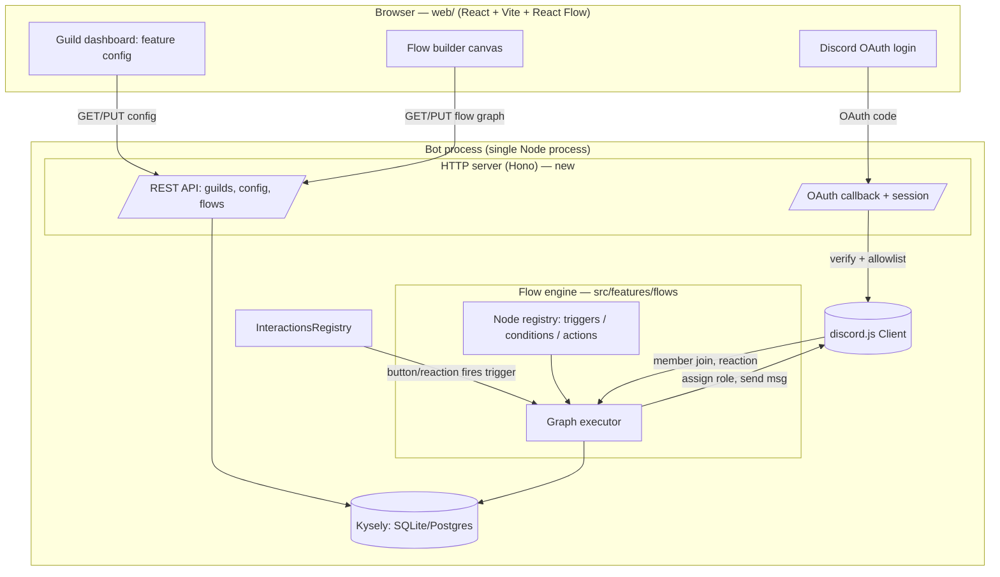

---
planStatus:
  planId: plan-web-ui-and-flow-engine
  title: Web UI & Visual Flow Engine
  status: in-development
  planType: initiative
  priority: high
  owner: douglas
  stakeholders: []
  tags: [web-ui, flow-engine, architecture, discord-oauth]
  created: "2026-09-11"
  updated: "2026-09-12T08:00:00.000Z"
  progress: 100
---

# Web UI & Visual Flow Engine

## 1. Objective

Give this bot a **web dashboard** (Discord-OAuth login) for configuring servers, and a **visual node-graph flow engine** so behaviours like an onboarding "agree to rules → assign role" flow can be *built and edited in the UI* instead of coded per feature.

Two deliverables, sequenced:

1. **Web UI foundation** — a React dashboard you log into with Discord, that reads/writes the existing per-guild config that today lives behind slash-command modals.
2. **Flow engine + builder** — a node-graph model (trigger → conditions → actions), a runtime executor inside the bot, and a React Flow canvas to author them.

### Decisions locked in (from kickoff)

| Question | Decision | Consequence |
|---|---|---|
| Audience | **Single-tenant** (your servers + trusted admins) | No billing/onboarding funnel. But *don't* bake in assumptions that block multi-tenant later — keep everything keyed by `guildId`, gate access by an allowlist, never by "the one guild". |
| Flow model | **Full visual node graph** | Node registry + graph executor, not fixed recipe templates. Phased so onboarding ships before the whole editor is polished. |
| Web/bot topology | **Same process as the bot** | HTTP server boots inside `src/bot.ts`. Shares the live `DISCORD_CLIENT` and `database` singleton directly — no IPC, no SQLite multi-writer problem. Structured so it can be split to a separate process later. |
| Engine v1 scope | **Linear + branch (if/else), no loops/delays yet** | Executor walks a DAG; conditions fork; no durable timers in v1. Loops, `delay`, and `wait-for-event` nodes are a later phase (needs durable state). |
| Frontend stack | **React + Vite + React Flow (xyflow) + Mantine (fully customized)** | New `web/` workspace package. React Flow is the node-canvas standard. Mantine is the component library, but **fully themed** — a custom Mantine theme (colors, radius, spacing, fonts, component defaults) so it looks bespoke, not stock Mantine. |
| Brand | **Logo: `assets/brand/spicybot-logo.png`; accent: cyan (~`#00A2FF`)** | Horned mascot, black/white with cyan accents. Cyan is the primary brand color (not Discord blurple). Node-kind colors on the canvas stay distinct (see §5.5). |
| Servers | **Single server for now** | No per-server color coding / multi-color switcher. The sidebar shows the one active server plainly; the switcher stays in the layout (keyed by `guildId`) but is visually minimal until multi-server matters. |

## 2. Current architecture (what we build on)

Grounded in the existing code — the web UI and flow engine **reuse these, they don't replace them**.

- **Entry / bootstrap**: [`src/bot.ts`](/C:/Users/Douglas/Documents/01%20Programming/01%20Personal/discord-spicy-bot/src/bot.ts) registers commands, calls each `init*()`, logs in, and funnels `Events.InteractionCreate` into the registry. This is where the HTTP server will also boot.
- **Interaction routing**: [`src/features-system/commands/interactionsRegistry.ts`](/C:/Users/Douglas/Documents/01%20Programming/01%20Personal/discord-spicy-bot/src/features-system/commands/interactionsRegistry.ts) — a singleton `Map<custom_id | commandName, handler>`. **Exact-match only** — no prefix/dynamic matching. The flow engine needs dynamically-created buttons (one per flow node), so this is a key extension point (see §5.4).
- **Per-guild config precedent**: [`src/features/tickets/data/ticketingSchema.ts`](/C:/Users/Douglas/Documents/01%20Programming/01%20Personal/discord-spicy-bot/src/features/tickets/data/ticketingSchema.ts) stores a whole `TicketingConfig` object in one `JSONColumnType` column, keyed by `guildId`, with an `entityVersion` for migrations. **This is the direct model for storing a flow definition.**
- **Data layer**: Kysely over SQLite/Postgres. New tables get registered on the `Database` interface in `data-persistence/database.ts`, plus a dated migration with `postgres`/`sqlite` branches, run via `pnpm migrate:latest`. Custom `SqliteJsonPlugin` already handles JSON columns.
- **Feature module convention** (`AGENTS.md`): each feature is `src/features/<kebab>/` with `init<Feature>.ts`, `commands/`, `components/`, `data/` (`*Schema.ts` + `*Repo.ts`), `logic/`. The flow engine follows the same convention as a first-class feature: `src/features/flows/`.
- **No existing HTTP/auth surface.** The only network-ish thing is a file-based healthcheck. Discord OAuth is net-new. `hono` already resolves transitively (dep of `@openai/agents`) — a candidate server framework.

> **Product-persona note** (`AGENTS.md` / `.cursor/rules`): this is an adults-only, NSFW, sassy-persona community bot. Dashboard copy and default flow templates should match that voice, not corporate-safe defaults.

## 3. High-level architecture



Key point: the **flow executor reuses the same `database` repos and the live `DISCORD_CLIENT`** the bot already has. Triggers are wired through the existing gateway-event + interaction-registry mechanisms; actions call discord.js directly.

## 4. Data model

### 4.1 `flows` table (new)

Follows the ticketing JSON-blob precedent. One row per flow; a guild has many flows.

```ts
// src/features/flows/data/flowsSchema.ts
export interface FlowTable {
    id: Generated<number>;
    flowId: string;          // stable public id (nanoid), referenced by node custom_ids
    guildId: string;         // index; multi-tenant-safe
    name: string;
    enabled: boolean;
    graph: JSONColumnType<FlowGraph>;   // the node/edge definition
    entityVersion: number;   // schema migration marker (matches existing convention)
    createdAt: Generated<...>;
    updatedAt: ...;
}
```

### 4.2 `FlowGraph` (the JSON blob)

```ts
interface FlowGraph {
    version: 1;
    nodes: FlowNode[];
    edges: FlowEdge[];     // source node -> target node, optional sourceHandle for branch outputs
}

interface FlowNode {
    id: string;                        // uuid within the graph
    type: string;                      // registry key, e.g. "trigger.button", "action.assignRole"
    position: { x: number; y: number };// for the React Flow canvas
    data: Record<string, unknown>;     // node-type-specific config (validated by that node's Zod schema)
}

interface FlowEdge {
    id: string;
    source: string; sourceHandle?: string;  // e.g. "true"/"false" for a condition node
    target: string; targetHandle?: string;
}
```

### 4.3 Runtime state tables (deferred to loop/delay phase)

Not needed for v1 (linear + branch executes synchronously). When we add `delay` / `wait-for-event`, we add a `flow_runs` table (durable pause/resume state). Called out now so the executor is written to *return* a result rather than assume it always completes inline.

### 4.4 Web sessions

- **Stateless signed JWT in an httpOnly cookie** (no DB table). Payload: Discord user id, granted guild ids, expiry. Signed with `SESSION_SECRET`. Coarse revocation only (rotate the secret) — acceptable for single-tenant with a small allowlist. If we later want "log out everywhere" or session auditing, promote to a `web_sessions` table (self-contained change).

## 5. Component design

### 5.1 HTTP server (new: `src/web/`)

- Boots from `bot.ts` after login (or in parallel — it only needs `database`; it can serve before the client is `ready`). New env: `WEB_PORT`, `WEB_PUBLIC_URL`, `DISCORD_OAUTH_CLIENT_SECRET`, `SESSION_SECRET`, `ADMIN_DISCORD_IDS` (allowlist).
- **Framework**: Hono (already resolvable; tiny, ESM-native, Node-server adapter exists).
- **Serving**: Vite builds `web/` into static assets; **Hono serves those static files from the same port as the API**. One container, one exposed port on Coolify — simplest deploy. The Docker image build gains a `pnpm --filter web build` step and copies `web/dist` into the image.
- **Dev**: Vite dev server proxies `/api` to the bot process, so `pnpm dev` runs bot + web together.

### 5.2 Discord OAuth + authorization

- Standard OAuth2 `identify` + `guilds` scopes. On callback: exchange code, fetch the user's guilds, intersect with guilds the bot is in **and** check the user against `ADMIN_DISCORD_IDS` (single-tenant gate). Store a session.
- Per-guild authorization: a user may configure a guild only if they have `Manage Guild` there (from the OAuth `guilds` payload) *and* pass the allowlist. This rule is the single seam we'd relax to go multi-tenant.

### 5.3 Config API (Phase 1 deliverable — proves the whole stack end to end)

- Generic pattern: each existing feature exposes a **config descriptor** (Zod schema + read/write via its existing repo). The API surfaces `GET/PUT /api/guilds/:guildId/config/:feature`.
- **Refactor note**: today config is written from slash-command modal handlers. We extract the *validation + persistence* into the feature's `logic/`/`repo` layer (pure, no `interaction`), so both the modal handler **and** the web API call the same function. Low-risk, incremental, one feature at a time. Start with **warnings** (simplest: one `modChannelId`) as the reference migration, then leveling/tickets.

### 5.4 Flow engine (`src/features/flows/`)

**Node registry** — each node type is a self-describing module:

```ts
interface NodeDefinition<TConfig> {
    type: string;                    // "action.assignRole"
    kind: "trigger" | "condition" | "action";
    label: string;
    configSchema: ZodType<TConfig>;  // validates node.data; also drives the builder's form UI
    // triggers: how this node subscribes (gateway event / registered component)
    // condition: evaluate(ctx) -> which output handle
    // action: execute(ctx, config) -> void | result
}
```

v1 node catalogue:
- **Triggers**: `trigger.buttonClick` (renders a button in a channel/message), `trigger.memberJoin`, `trigger.reactionAdd`.
- **Conditions**: `condition.hasRole`, `condition.inChannel` (single if/else, two output handles).
- **Actions**: `action.assignRole`, `action.removeRole`, `action.sendMessage`, `action.sendDM`, `action.postEmbed`.

This set fully covers the **onboarding example**: `trigger.buttonClick` (on the rules message) → `action.assignRole` (Member) → `action.sendDM` (welcome).

**Executor** — loads a flow, starts at the fired trigger node, walks edges; at a condition node evaluates and follows the matching handle; runs action nodes in order. v1 is synchronous/inline. Returns a structured result (logged like commands are today). Guardrails: max node visits per run, per-flow enable flag, structured error logging.

**Wiring triggers into the existing system** — the notable extension point:
- Gateway triggers (`memberJoin`, `reactionAdd`): the flows feature attaches one `DISCORD_CLIENT.on(...)` listener per event type, looks up flows for that guild whose trigger matches, and invokes the executor. Mirrors how `leveling` attaches listeners.
- Button triggers: each button gets a `custom_id` like `flow:<flowId>:<nodeId>`. The exact-match `InteractionsRegistry` **can't** match that dynamically today. **Extension**: add a prefix/dynamic-handler registration (`registerDynamic(prefix, handler)`) to the registry, or a single `flow:` catch-all handler registered once that parses the id and dispatches to the executor. (Prefer the single catch-all — smaller change, no registry API churn.)

### 5.5 Flow builder UI (`web/`)

- React Flow canvas, styled to match the custom Mantine theme (canvas background, node cards, and edges use the theme tokens, not React Flow's stock look). Left palette of node types (from the registry, exposed via `GET /api/nodes`). Clicking a node opens a config panel with a **hand-built React form per node type** (Mantine inputs) — full control over UX (real Discord role/channel pickers backed by `GET /api/guilds/:id/roles` & `/channels`, not raw ID text boxes). Chosen over schema-auto-generation because v1 has only ~10 node types; if the catalogue grows large, revisit a schema-driven renderer with per-field UI hints. Save serializes to `FlowGraph` and `PUT`s it. Validation runs both client-side and server-side (server is authoritative, via each node's Zod `configSchema`).

## 6. Phasing

Each phase is independently shippable and testable.

- [x] **Phase 0 — Scaffolding.** ✅ pnpm workspace enabled; `web/` Vite+React+Mantine package with the custom cyan `theme.ts`; logo in `web/public/`; in-process Hono server (`/api/health`) started from `bot.ts`, self-disables when web env vars are unset; Dockerfile builds `web/dist`; dev scripts. See ADR `docs/adr/0001-web-server-in-bot-process.md`.
- [x] **Phase 1 — Auth + read-only dashboard.** ✅ Discord OAuth (`identify guilds`), stateless JWT session (httpOnly cookie), admin-allowlist gate, signed CSRF state. `/api/guilds`, `/channels`, read-only `/config/warnings`. Real Mantine dashboard (login gate, AppShell, sidebar nav, warnings page). `src/web/auth/*`, `src/web/api/*`, `web/src/*`.
- [x] **Phase 2 — Config editing.** ✅ Shared `setWarningsModChannel` backs both the Discord modal and the new `PUT /api/guilds/:id/config/warnings`; editable warnings page with a real channel picker + notifications. Leveling/tickets deferred (same pattern, later). 45/45 warnings tests pass.
- [x] **Phase 3 — Flow engine core (headless).** ✅ `flows` table + repo + `FlowGraph` types/zod; node registry (button/memberJoin triggers, hasRole condition, assign/remove-role, DM, message actions); DAG executor (linear+branch, cycle detection, visit cap, per-node error isolation); additive `registerDynamic('flow:')` on the interactions registry; `/flow-deploy` command + `seedOnboardingFlow.ts`. Onboarding flow proven via tests (role add + DM). 7/7 flow tests pass; migration applies. **No builder UI yet.**
- [x] **Phase 4 — Flow builder UI.** ✅ Flows REST API (list/get/create/update/delete/deploy) + `/api/nodes` registry descriptor + `/roles` endpoint; remaining v1 nodes shipped (`trigger.reactionAdd` with a `MessageReactionAdd` listener, `condition.inChannel`, `action.postEmbed`). React Flow canvas with drag-and-drop palette, hand-built per-node config forms with real role/channel pickers, dual true/false handles on conditions, undo/redo, deploy modal, and a flows list page. 29/29 flow tests; all 12 frontend-called routes verified present + auth-protected.
- [x] **Phase 5 — Durable nodes.** ✅ `flow_runs` table + repo + a 15s poller (with a startup sweep so delays that elapsed while the bot was down fire immediately), mirroring the birthday-scheduler lifecycle. `action.delay` and `action.waitForEvent` suspend a run and persist it; event dispatchers wake parked runs. **Cycles are now allowed** — `validateFlowGraph` no longer rejects back-edges, so real loops are buildable; the visit cap is the runtime guard. Builder UI extended for both new nodes (duration editor, event-kind picker, `timeout` output handle). 61/61 flow tests.
  - **Not included** (deliberately descoped this pass): template gallery, run-history/observability UI.

## 7. Risks & considerations

- **SQLite + web reads**: same-process means one connection, fine. If we ever split the web server out, must move to Postgres or a shared-connection strategy. Keep repos the only DB touchpoint so this stays swappable.
- **Registry dynamic dispatch** (§5.4) is the one change to shared infra — keep it additive (a `flow:` catch-all), don't break existing exact-match handlers.
- **Secrets**: OAuth client secret + session secret via the existing `env-var`/`.env.local` (dotenvx) path. Never commit.
- **Executor safety**: ~~validate the graph is a DAG on save~~ — **superseded in Phase 5.** Cycles are now permitted so loops can be built, which makes `FLOW_MAX_NODE_VISITS` the *only* runaway guard. Two consequences were handled explicitly:
  - The visit budget (`visitsUsed`) is **persisted on the run row and carried across resumes**, so a loop containing an `action.delay` cannot reset its budget by parking — otherwise durable delays + cycles would produce an immortal flow.
  - `hasCycle` is retained (exported, tested) as an *informational* check, useful for warning that a flow loops with no delay in the cycle.
- **Durable runs are per-user**: a parked `waitForEvent` run resumes only for its own `contextSnapshot.userId`. Resumed runs re-fetch the guild/member and have **no `interaction`** (Discord interactions expire ~15 min), so interaction-dependent nodes degrade gracefully; a departed member fails the run cleanly.
- **Deploy**: Coolify currently runs the bot container with a file-based healthcheck. Adding an HTTP port means exposing/proxying `WEB_PORT` and building the `web/` assets in the Docker image. Flagged for the Phase 0/1 deploy step.
- **Scope discipline**: the full node graph is large. The phasing deliberately gets a working onboarding flow (Phase 3) *before* the canvas editor (Phase 4), so value lands early.

## 8. Resolved design decisions

Settled in the refinement round:

- **Serving/deploy**: Bot (Hono) serves the built React static assets from the same port as the API. One Coolify container/port. Docker build adds `pnpm --filter web build`.
- **Sessions**: Stateless signed JWT in an httpOnly cookie; no session table in v1.
- **Node config forms**: Hand-built React form per node type with real Discord role/channel pickers.
- **Component library**: **Mantine, fully customized** — a bespoke theme drives colors/radius/fonts/component defaults so it doesn't read as stock Mantine.
- **Brand**: Logo committed at `assets/brand/spicybot-logo.png`; primary accent is **cyan (~`#00A2FF`)** from the mascot, not Discord blurple.
- **Servers**: Single server for now — no per-server color coding; sidebar server switcher is visually minimal.
- **Mockups**: Yes — dashboard + flow builder mockups created and embedded below (§9).

## 9. UI mockups

**Guild dashboard** — server switcher, per-feature config editor (Warnings shown), and a Flows callout:

[Guild dashboard mockup](mockups/guild-dashboard.mockup.html "width=1000 height=680")

**Flow builder** — node palette, canvas with the concrete onboarding flow (Button Click → Has Role? branch → Assign Role → Send DM), and a per-node config inspector:

[Flow builder mockup](mockups/flow-builder.mockup.html "width=1000 height=680")

